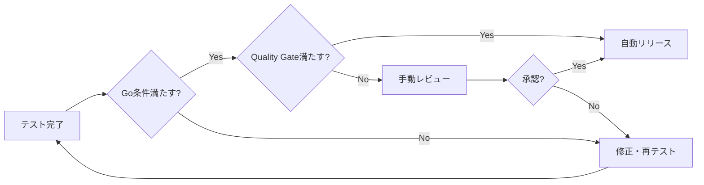
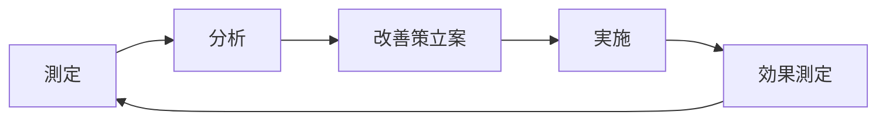

# CouplePlan テスト計画書

## ドキュメント情報

- **作成日**: 2025年10月11日
- **バージョン**: 1.0.0
- **作成者**: 開発チーム
- **承認者**: プロダクトオーナー
- **最終更新**: 2025年10月11日

## 目次

1. [エグゼクティブサマリー](#1-エグゼクティブサマリー)
2. [テスト戦略](#2-テスト戦略)
3. [テストスコープ](#3-テストスコープ)
4. [テストレベル](#4-テストレベル)
5. [テスト環境](#5-テスト環境)
6. [テストデータ管理](#6-テストデータ管理)
7. [テスト実行計画](#7-テスト実行計画)
8. [品質基準とKPI](#8-品質基準とkpi)
9. [リソース計画](#9-リソース計画)
10. [リスク管理](#10-リスク管理)
11. [テストスケジュール](#11-テストスケジュール)
12. [ツールとライブラリ](#12-ツールとライブラリ)

---

## 1. エグゼクティブサマリー

### 1.1 プロジェクト概要

**プロジェクト名**: CouplePlan  
**目的**: カップル向けデート体験統合プラットフォームの開発  
**技術スタック**:

- フロントエンド: Next.js 15, React 19, TypeScript, Tailwind CSS
- バックエンド: Supabase (PostgreSQL), Next.js API Routes
- AI: Google Gemini 2.5 Flash API
- 認証: Supabase Auth
- デプロイ: Google Cloud Run (Docker)

**アーキテクチャ**: マイクロサービスアーキテクチャ (MS-001〜MS-008)

**開発体制**: 1人体制（ソロ創業）

### 1.2 テスト目的

本テスト計画の目的は、CouplePlanプラットフォームの品質を保証し、以下を達成することです：

1. **機能品質**: 全ユースケースが仕様通りに動作することを保証
2. **信頼性**: システムの安定性と可用性を確保
3. **セキュリティ**: ユーザーデータの保護とセキュリティ脅威への対策
4. **パフォーマンス**: 応答時間とスループットの目標達成
5. **保守性**: コードの品質とテスト容易性の維持

### 1.3 テスト範囲のハイライト

**対象範囲**:

- 7つの主要ユースケース（UC-001〜UC-007）
- 34画面（認証4、共通5、各UC 25）
- 8つのマイクロサービス（MS-001〜MS-008）
- 外部API統合（Gemini AI, Stripe）

**テストレベル**:

- L0: 静的解析（TypeScript, ESLint）
- L1: 単体テスト（Jest）
- L2: 統合テスト（Jest + MSW）
- L3: E2Eテスト（Playwright）
- L4: 契約テスト（Pact）
- L5: 性能テスト
- L6: セキュリティテスト

### 1.4 品質目標とKPI

| メトリクス                | 目標値       | 測定方法               |
| ------------------------- | ------------ | ---------------------- |
| コードカバレッジ          | ≥ 80%        | Jest Coverage Report   |
| 分岐カバレッジ            | ≥ 75%        | Jest Coverage Report   |
| 機能カバレッジ (Critical) | ≥ 90%        | Manual Tracking        |
| バグ密度                  | < 1 bug/KLOC | Jira/GitHub Issues     |
| E2E成功率                 | ≥ 95%        | Playwright Test Report |
| ページロード時間 (P90)    | < 3秒        | Lighthouse             |
| AI生成時間 (平均)         | < 25秒       | Custom Metrics         |
| API応答時間 (P95)         | < 2秒        | Cloud Monitoring       |
| コールドスタート時間      | < 5秒        | Cloud Run Metrics      |

### 1.5 主要リスク

| リスク                | 影響度 | 発生確率 | 対策                             |
| --------------------- | ------ | -------- | -------------------------------- |
| AI API不安定性        | High   | Medium   | Mock/Stub活用、リトライ機構      |
| 1人体制のリソース制約 | High   | High     | 自動化優先、優先度付け           |
| テストデータ管理      | Medium | Low      | 自動生成ツール、シードスクリプト |
| E2E実行時間           | Medium | High     | 並列実行、選択的実行             |

---

## 2. テスト戦略

### 2.1 テストアプローチ

#### 2.1.1 シフトレフト戦略

開発の早い段階でテストを統合し、バグの早期発見とコスト削減を実現します。

**実践方法**:

- TDD（Test-Driven Development）の推奨
- コードレビューでのテスト確認
- CI/CDパイプラインでの自動テスト
- 静的解析ツールの活用

#### 2.1.2 テストピラミッド

効率的なテスト構成を実現するため、以下の比率を目指します：

```
        /\
       /  \  E2E (10%)
      /----\
     /      \ Integration (20%)
    /--------\
   /          \ Unit (70%)
  /--------------\
```

**理由**:

- 単体テストは高速で安定、コスト効率が良い
- 統合テストで主要な連携を検証
- E2Eテストはクリティカルパスに限定

#### 2.1.3 自動化優先方針

**目標**: 自動化率 ≥ 80%

**自動化対象**:

- ✅ 単体テスト: 100%自動化
- ✅ 統合テスト: 100%自動化
- ✅ E2Eテスト: 80%自動化（クリティカルパス優先）
- ⚠️ 探索的テスト: 手動（20%）

**自動化しないもの**:

- UX/感覚的評価
- 複雑な視覚的検証
- 実験的機能の初期検証

#### 2.1.4 リスクベーステスト

リソース制約を考慮し、リスクの高い領域に注力します。

**優先度マトリクス**:

| 影響度 \ 発生確率 | High          | Medium      | Low         |
| ----------------- | ------------- | ----------- | ----------- |
| **High**          | P0 (Critical) | P1 (High)   | P2 (Medium) |
| **Medium**        | P1 (High)     | P2 (Medium) | P3 (Low)    |
| **Low**           | P2 (Medium)   | P3 (Low)    | P3 (Low)    |

### 2.2 テストレベル定義

#### L0: 静的解析

**目的**: コード品質の基本保証、構文エラーの早期発見

**ツール**:

- TypeScript Compiler: 型安全性チェック
- ESLint: コーディング規約違反検出
- Prettier: コードフォーマット統一

**実行タイミング**: コミット前、PR作成時

**合格基準**:

- TypeScriptエラー: 0件
- ESLintエラー: 0件（警告は許容）

#### L1: 単体テスト（Jest）

**目的**: 個別関数・コンポーネントの動作検証

**対象**:

- ユーティリティ関数
- ビジネスロジック
- Reactコンポーネント
- カスタムフック

**カバレッジ目標**: 80%以上

**実行タイミング**: コミット時、CI/CD

**テストケース見積もり**: 約400ケース

#### L2: 統合テスト（Jest + MSW）

**目的**: モジュール間連携、API統合の検証

**対象**:

- API Routes
- Supabase連携
- 外部API連携（Gemini, Stripe）
- データフロー

**カバレッジ目標**: 70%以上

**実行タイミング**: PR作成時、デプロイ前

**テストケース見積もり**: 約200ケース

#### L3: E2Eテスト（Playwright）

**目的**: エンドツーエンドの業務フロー検証

**対象**:

- クリティカルパス（認証、プラン生成、決済）
- 主要ユーザーフロー
- クロスブラウザ互換性

**カバレッジ目標**: クリティカルパス 100%

**実行タイミング**: デプロイ前、Nightly

**テストケース見積もり**: 約80ケース

#### L4: 契約テスト（Pact）

**目的**: マイクロサービス間の契約整合性検証

**対象**:

- フロントエンド ⟷ User Management Service
- フロントエンド ⟷ Date Planning Service
- フロントエンド ⟷ Monetization Service

**実行タイミング**: API変更時、デプロイ前

**テストケース見積もり**: 約50ケース

#### L5: 性能テスト

**目的**: システムのパフォーマンス検証

**対象**:

- ページロード時間
- API応答時間
- AI生成時間
- データベースクエリ

**実行タイミング**: リリース前、定期実行（月次）

**テストシナリオ**: 5シナリオ

#### L6: セキュリティテスト

**目的**: セキュリティ脆弱性の検出

**対象**:

- 認証・認可
- XSS/CSRF対策
- SQLインジェクション
- API セキュリティ

**実行タイミング**: リリース前、定期実行（四半期）

**テストケース見積もり**: 約40ケース

### 2.3 フェーズ別テスト戦略

#### Phase 1: MVP（現在〜3ヶ月）

**焦点**: 基本機能の品質保証

**対象機能**:

- ✅ 認証システム（完了）
- ✅ プロフィール・パートナー連携（完了）
- 🚧 UC-001: AIデートプラン（90%完了）
- 📝 UC-007: マネタイズ制限機能（開始予定）

**テスト活動**:

1. テスト基盤構築（CI/CD, 環境）
2. 単体テスト充実（カバレッジ70% → 80%）
3. E2Eクリティカルパス実装
4. セキュリティ基本検証

**成功基準**:

- P0バグゼロ
- カバレッジ ≥ 75%
- E2Eクリティカルパス全Pass

#### Phase 2: 拡張機能（3〜6ヶ月）

**焦点**: 差別化機能の品質保証

**対象機能**:

- UC-002: 共同編集
- UC-005: Date Canvas
- リアルタイム同期

**テスト活動**:

1. 統合テスト拡充
2. 契約テスト導入
3. 性能テスト実施
4. クロスブラウザテスト

**成功基準**:

- カバレッジ ≥ 80%
- 性能目標達成
- リグレッションゼロ

#### Phase 3: 差別化・最適化（6〜12ヶ月）

**焦点**: 高度機能と運用品質

**対象機能**:

- UC-004: AI仲裁
- UC-003: ポータル統合
- 高度な分析機能

**テスト活動**:

1. セキュリティテスト自動化
2. 負荷テスト実施
3. カオステスト導入
4. アクセシビリティテスト

**成功基準**:

- 全KPI達成
- 自動化率 ≥ 80%
- インシデント < 1件/月

---

## 3. テストスコープ

### 3.1 ユースケース別スコープ

#### UC-001: AIデートプラン提案・生成（実装済み90%）

**優先度**: P0 (Critical)

**対象画面**:

1. UC001-001: デートプラン作成画面
2. UC001-002: AI生成中画面
3. UC001-003: プラン提案画面
4. UC001-004: プラン詳細画面
5. UC001-005: カスタマイズビュー画面

**主要機能**:

- ユーザー入力フォーム（予算、地域、好み）
- Gemini API連携（プラン生成）
- プラン表示・選択
- プランカスタマイズ
- プラン保存（Supabase）

**テストケース数**: 120ケース

- 単体テスト: 60ケース
- 統合テスト: 40ケース
- E2Eテスト: 20ケース

**特記事項**:

- AI生成の品質検証（出力形式、データ完全性）
- レート制限対応テスト
- エラーハンドリング（タイムアウト、API障害）

#### UC-002: カップル共同デートプラン編集（未実装）

**優先度**: P1 (High)

**対象画面**:

1. UC002-001: 共同編集画面
2. UC002-002: 編集競合解決画面
3. UC002-003: 編集履歴画面
4. UC002-004: プレビュー画面
5. UC002-005: 承認ワークフロー画面

**主要機能**:

- リアルタイム共同編集（Supabase Realtime）
- 編集競合解決（OT/CRDT）
- 編集履歴管理
- プレビュー機能

**テストケース数**: 100ケース

**特記事項**:

- 同時編集の整合性検証
- ネットワーク遅延シミュレーション
- 競合解決アルゴリズムテスト

#### UC-003: ポータル起点統合プラットフォーム（未実装）

**優先度**: P2 (Medium)

**対象画面**:

1. UC003-001: ポータルトップ画面
2. UC003-002: デート情報検索画面
3. UC003-003: 記事詳細画面
4. UC003-004: アプリ誘導画面
5. UC003-005: 利用ガイド画面

**主要機能**:

- SEOコンテンツ配信
- 検索・フィルター
- アプリへの導線

**テストケース数**: 60ケース

#### UC-004: AI喧嘩仲裁・関係修復システム（未実装）

**優先度**: P1 (High)

**対象画面**:

1. UC004-001: 仲裁依頼画面
2. UC004-002: 状況分析画面
3. UC004-003: 仲裁提案画面
4. UC004-004: 関係改善プラン画面
5. UC004-005: 振り返りレポート画面

**主要機能**:

- 対立検知
- AI仲裁提案
- 関係性スコア計算
- フォローアップ

**テストケース数**: 80ケース

**特記事項**:

- 感情分析の精度検証
- プライバシー保護テスト

#### UC-005: Date Canvas共同編集ボード（未実装）

**優先度**: P2 (Medium)

**主要機能**:

- 位置情報ピン
- 思い出記録
- 画像アップロード
- タグ管理

**テストケース数**: 70ケース

#### UC-007: 段階的マネタイズ制御（開始予定）

**優先度**: P0 (Critical)

**対象画面**:

1. UC007-001: 課金管理画面
2. UC007-002: 機能解放画面
3. UC007-003: 課金変更通知画面
4. UC007-004: 課金指標分析画面
5. UC007-005: サブスクリプション管理画面

**主要機能**:

- AIプラン生成制限（日次3回、月次10回）
- Premium案内
- Stripe連携（将来）
- Feature Flag管理

**テストケース数**: 80ケース

**特記事項**:

- 制限ロジックの精度検証
- タイムゾーン処理（JST）
- 決済フロー（モック）

#### 共通機能（COMMON）

**優先度**: P0 (Critical)

**対象画面**:

1. COMMON-001: ダッシュボード画面
2. COMMON-002: 設定画面
3. COMMON-003: ヘルプセンター画面
4. COMMON-004: エラー画面
5. COMMON-005: オフラインモード画面

**主要機能**:

- ナビゲーション
- 通知センター
- プロフィール表示
- エラーハンドリング

**テストケース数**: 100ケース

#### 認証機能（AUTH）

**優先度**: P0 (Critical)

**対象画面**:

1. AUTH-001: ログイン・アカウント作成画面
2. AUTH-002: メール認証画面
3. AUTH-003: プライバシー設定画面
4. AUTH-004: パートナー連携設定画面

**主要機能**:

- ユーザー登録・ログイン（Supabase Auth）
- メール認証
- パスワードリセット
- パートナー招待・連携

**テストケース数**: 80ケース

**特記事項**:

- セキュリティテスト重点
- RLSポリシー検証
- セッション管理テスト

### 3.2 テスト対象外

以下は本計画の対象外とします：

- **外部サービスの内部動作**: Gemini API、Stripe API、Supabaseの内部ロジック
- **インフラストラクチャ**: Cloud Run、Supabaseのインフラ層（SLA保証に依存）
- **サードパーティライブラリ**: Next.js、Reactなどのフレームワーク本体
- **探索的デザイン検証**: 実験的なUI/UX改善（A/Bテストで検証）

### 3.3 優先度付けマトリクス

| 機能カテゴリ   | 優先度 | ビジネス影響 | 技術リスク | Phase |
| -------------- | ------ | ------------ | ---------- | ----- |
| 認証・認可     | P0     | High         | Low        | 1     |
| AIプラン生成   | P0     | High         | High       | 1     |
| マネタイズ制限 | P0     | High         | Medium     | 1     |
| データ永続化   | P0     | High         | Low        | 1     |
| パートナー連携 | P1     | High         | Medium     | 1     |
| 共同編集       | P1     | High         | High       | 2     |
| AI仲裁         | P1     | Medium       | High       | 3     |
| ポータル統合   | P2     | Medium       | Low        | 3     |
| Date Canvas    | P2     | Medium       | Medium     | 2     |
| 分析・レポート | P3     | Low          | Low        | 3     |

---

## 4. テストレベル

### 4.1 単体テスト（Jest）

#### 4.1.1 目的

個別の関数、コンポーネント、モジュールの動作を独立して検証し、バグの早期発見とコード品質を保証します。

#### 4.1.2 テスト対象

**ユーティリティ関数**:

- `src/lib/utils.ts`: クラス名結合、汎用ヘルパー
- `src/lib/validation.ts`: バリデーションロジック
- `src/lib/date-utils.ts`: 日付操作

**ビジネスロジック**:

- `src/lib/ai-service.ts`: AI生成ロジック
- `src/lib/plan-validation.ts`: プラン検証
- `src/lib/subscription-logic.ts`: サブスクリプションロジック

**Reactコンポーネント**:

- `src/components/ui/**/*.tsx`: UIコンポーネント
- `src/components/features/**/*.tsx`: 機能コンポーネント
- `src/components/subscription/**/*.tsx`: サブスク関連

**カスタムフック**:

- `src/hooks/useRequireAuth.ts`: 認証フック
- `src/hooks/useSubscription.ts`: サブスクフック

#### 4.1.3 テストケース例

```typescript
// src/lib/ai-service.test.ts
import { generateDatePlan } from './ai-service';

describe('AI Service - generateDatePlan', () => {
  it('should generate valid plan with correct structure', async () => {
    const input = {
      budget: 10000,
      area: 'tokyo',
      preferences: ['restaurant', 'movie'],
    };

    const result = await generateDatePlan(input);

    expect(result).toHaveProperty('title');
    expect(result).toHaveProperty('items');
    expect(result.items).toBeInstanceOf(Array);
    expect(result.items.length).toBeGreaterThan(0);
  });

  it('should handle rate limit errors gracefully', async () => {
    // Rate limitエラーをモック
    jest.spyOn(global, 'fetch').mockRejectedValueOnce(new Error('Rate limit exceeded'));

    await expect(generateDatePlan({})).rejects.toThrow();
  });

  it('should retry on temporary failures', async () => {
    let callCount = 0;
    jest.spyOn(global, 'fetch').mockImplementation(() => {
      callCount++;
      if (callCount === 1) {
        return Promise.reject(new Error('Temporary failure'));
      }
      return Promise.resolve(new Response(JSON.stringify({ success: true })));
    });

    const result = await generateDatePlan({});
    expect(callCount).toBe(2);
    expect(result).toBeDefined();
  });
});
```

#### 4.1.4 カバレッジ目標

| カテゴリ         | 目標 | 理由                     |
| ---------------- | ---- | ------------------------ |
| ビジネスロジック | 90%  | クリティカル、バグ影響大 |
| ユーティリティ   | 85%  | 広範囲で使用             |
| コンポーネント   | 75%  | UI変更が多い             |
| 全体             | 80%  | バランス重視             |

#### 4.1.5 実行方法

```bash
# 全単体テスト実行
npm run test:unit

# ウォッチモード
npm run test:watch

# カバレッジレポート生成
npm run test:coverage
```

#### 4.1.6 合格基準

- ✅ 全テストPass
- ✅ カバレッジ ≥ 80%
- ✅ 実行時間 < 2分

### 4.2 統合テスト（Jest + MSW）

#### 4.2.1 目的

複数モジュールの連携、API統合、データフローを検証し、システム全体の整合性を保証します。

#### 4.2.2 テスト対象

**API Routes**:

- `/api/plans/generate`: AIプラン生成
- `/api/subscription/check-limit`: 制限チェック
- `/api/subscription/usage`: 使用履歴記録
- `/api/partner/invite`: パートナー招待

**Supabase連携**:

- ユーザー認証フロー
- データCRUD操作
- RLSポリシー検証
- リアルタイム購読

**外部API連携**:

- Gemini API（MSWでモック）
- Stripe API（MSWでモック）

#### 4.2.3 テストケース例

```typescript
// tests/integration/api/plans.test.ts
import { http, HttpResponse } from 'msw';
import { setupServer } from 'msw/node';

const server = setupServer(
  http.post('https://generativelanguage.googleapis.com/v1/*', () => {
    return HttpResponse.json({
      candidates: [
        {
          content: {
            parts: [
              {
                text: JSON.stringify({
                  title: 'テストプラン',
                  items: [{ name: 'レストラン', budget: 5000, duration: 120 }],
                }),
              },
            ],
          },
        },
      ],
    });
  })
);

beforeAll(() => server.listen());
afterEach(() => server.resetHandlers());
afterAll(() => server.close());

describe('Plans API Integration', () => {
  it('should create plan via API and save to database', async () => {
    const response = await fetch('/api/plans/generate', {
      method: 'POST',
      headers: { 'Content-Type': 'application/json' },
      body: JSON.stringify({
        budget: 10000,
        area: 'tokyo',
      }),
    });

    expect(response.status).toBe(200);

    const data = await response.json();
    expect(data).toHaveProperty('plan');
    expect(data.plan).toHaveProperty('id');

    // データベース確認
    // ...
  });

  it('should handle Gemini API failure', async () => {
    server.use(
      http.post('https://generativelanguage.googleapis.com/v1/*', () => {
        return new HttpResponse(null, { status: 500 });
      })
    );

    const response = await fetch('/api/plans/generate', {
      method: 'POST',
      headers: { 'Content-Type': 'application/json' },
      body: JSON.stringify({ budget: 10000 }),
    });

    expect(response.status).toBe(500);
  });
});
```

#### 4.2.4 実行方法

```bash
# 統合テスト実行
npm run test:integration

# カバレッジ付き
npm run test:integration -- --coverage
```

#### 4.2.5 合格基準

- ✅ 全テストPass
- ✅ カバレッジ ≥ 70%
- ✅ 実行時間 < 5分

### 4.3 E2Eテスト（Playwright）

#### 4.3.1 目的

実際のユーザー操作をシミュレートし、エンドツーエンドの業務フローが正常に動作することを検証します。

#### 4.3.2 クリティカルパス定義

**Critical Path 1: 新規ユーザー登録〜初回プラン生成**

```
AUTH-001（登録）
  → メール認証
  → AUTH-001（ログイン）
  → COMMON-001（ダッシュボード）
  → UC001-001（プラン作成）
  → UC001-002（AI生成中）
  → UC001-003（プラン提案）
  → UC001-004（プラン詳細）
```

**Critical Path 2: パートナー連携**

```
COMMON-001（ダッシュボード）
  → AUTH-004（パートナー連携）
  → 招待コード生成
  → （パートナーが招待受諾）
  → カップル確立
```

**Critical Path 3: マネタイズフロー**

```
UC001-001（プラン作成）
  → 制限到達
  → UC007-002（Premium案内）
  → （将来：決済フロー）
```

#### 4.3.3 テストケース例

```typescript
// tests/e2e/date-plan-generation.spec.ts
import { test, expect } from '@playwright/test';

test.describe('Date Plan Generation E2E', () => {
  test('should complete full plan generation flow', async ({ page }) => {
    // 1. ログイン
    await page.goto('/login');
    await page.fill('[name="email"]', 'test@example.com');
    await page.fill('[name="password"]', 'Test1234!');
    await page.click('button[type="submit"]');

    await page.waitForURL('/dashboard');
    await expect(page.locator('h1')).toContainText('ダッシュボード');

    // 2. プラン作成画面へ移動
    await page.click('text=デートプラン作成');
    await page.waitForURL('/dashboard/plans/create');

    // 3. フォーム入力
    await page.fill('[name="budget"]', '10000');
    await page.selectOption('[name="area"]', 'tokyo');
    await page.fill('[name="preferences"]', 'レストラン、映画');

    // 4. AI生成実行
    await page.click('text=プランを生成');

    // 5. 生成中画面
    await expect(page.locator('text=AI生成中')).toBeVisible();

    // 6. プラン提案画面
    await page.waitForSelector('.plan-card', { timeout: 30000 });
    await expect(page.locator('.plan-card')).toBeVisible();

    // 7. プラン選択
    await page.click('.plan-card:first-child');

    // 8. プラン詳細画面
    await expect(page.locator('h2')).toContainText('プラン詳細');
    await expect(page.locator('.plan-item')).toHaveCount(3);

    // 9. プラン保存
    await page.click('text=このプランを保存');
    await expect(page.locator('text=保存しました')).toBeVisible();
  });

  test('should show limit modal when reaching daily limit', async ({ page }) => {
    // 制限到達シナリオ
    // ...
  });
});
```

#### 4.3.4 クロスブラウザテスト

```typescript
// playwright.config.ts
export default {
  projects: [
    { name: 'chromium', use: { ...devices['Desktop Chrome'] } },
    { name: 'firefox', use: { ...devices['Desktop Firefox'] } },
    { name: 'webkit', use: { ...devices['Desktop Safari'] } },
    { name: 'mobile-chrome', use: { ...devices['Pixel 5'] } },
    { name: 'mobile-safari', use: { ...devices['iPhone 12'] } },
  ],
};
```

#### 4.3.5 実行方法

```bash
# 全ブラウザで実行
npm run test:e2e

# Chromiumのみ
npm run test:e2e:chromium

# ヘッドレスモード解除
npm run test:e2e:headed

# デバッグモード
npm run test:e2e:debug

# UIモード
npm run test:e2e:ui
```

#### 4.3.6 合格基準

- ✅ クリティカルパス全Pass（全ブラウザ）
- ✅ 成功率 ≥ 95%
- ✅ 実行時間 < 15分（並列実行）

### 4.4 契約テスト（Pact）

#### 4.4.1 目的

マイクロサービス間のAPI契約を検証し、インターフェース変更による破壊を防止します。

#### 4.4.2 契約定義

**Consumer: Frontend**
**Provider: User Management Service (MS-001)**

```typescript
// tests/cdc/pact/user-service.pact.test.ts
import { PactV3, MatchersV3 } from '@pact-foundation/pact';

const provider = new PactV3({
  consumer: 'Frontend',
  provider: 'UserManagementService',
});

describe('User Service Contract', () => {
  it('should get user profile', () => {
    provider
      .given('user exists')
      .uponReceiving('a request for user profile')
      .withRequest({
        method: 'GET',
        path: '/api/users/profile',
        headers: { Authorization: MatchersV3.like('Bearer token') },
      })
      .willRespondWith({
        status: 200,
        headers: { 'Content-Type': 'application/json' },
        body: {
          id: MatchersV3.uuid(),
          name: MatchersV3.string('Test User'),
          email: MatchersV3.email(),
          createdAt: MatchersV3.iso8601DateTime(),
        },
      });

    return provider.executeTest(async (mockServer) => {
      const response = await fetch(`${mockServer.url}/api/users/profile`, {
        headers: { Authorization: 'Bearer test-token' },
      });
      expect(response.status).toBe(200);
    });
  });
});
```

#### 4.4.3 実行方法

```bash
# 契約テスト実行
npm run test:cdc

# Pact契約生成
npm run test:cdc:pact
```

#### 4.4.4 合格基準

- ✅ 全契約Pass
- ✅ 契約ファイル生成成功

### 4.5 性能テスト

#### 4.5.1 目的

システムのパフォーマンスを測定し、応答時間とスループットの目標達成を検証します。

#### 4.5.2 テストシナリオ

**S1: 負荷テスト**

- 目的: 通常負荷での動作検証
- 同時ユーザー数: 100
- 実行時間: 10分
- 合格基準: エラー率 < 1%

**S2: ストレステスト**

- 目的: 限界値の把握
- 同時ユーザー数: 100 → 500（段階的増加）
- 実行時間: 20分
- 合格基準: システムダウンせず、エラー率 < 5%

**S3: スパイクテスト**

- 目的: 急激な負荷変動への対応
- パターン: 10 → 200 → 10（急増・急減）
- 合格基準: 回復時間 < 30秒

**S4: 持久力テスト**

- 目的: 長時間稼働の安定性
- 同時ユーザー数: 50
- 実行時間: 24時間
- 合格基準: メモリリークなし、パフォーマンス劣化 < 10%

**S5: Lighthouseスコア**

- Performance: ≥ 90
- Accessibility: ≥ 90
- Best Practices: ≥ 90
- SEO: ≥ 90

#### 4.5.3 実行方法

```bash
# Lighthouse実行
npx lighthouse https://coupleplan.app --output html --output-path ./report.html

# k6負荷テスト（将来導入）
# k6 run tests/performance/load-test.js
```

#### 4.5.4 合格基準

| メトリクス         | 目標値        | 測定方法          |
| ------------------ | ------------- | ----------------- |
| ページロード (P90) | < 3秒         | Lighthouse        |
| AI生成時間 (平均)  | < 25秒        | Custom Timer      |
| API応答 (P95)      | < 2秒         | Cloud Monitoring  |
| コールドスタート   | < 5秒         | Cloud Run Metrics |
| スループット       | > 100 req/sec | k6                |

### 4.6 セキュリティテスト

#### 4.6.1 目的

OWASP Top 10のセキュリティ脅威に対する耐性を検証します。

#### 4.6.2 テスト項目

**A01: アクセス制御の不備**

- 未認証アクセス防止
- RLSポリシー検証
- セッションハイジャック対策

**A02: 暗号化の失敗**

- HTTPS強制
- JWT署名検証
- パスワードハッシュ化

**A03: インジェクション**

- SQLインジェクション対策（Supabase RLS）
- XSS対策（DOMPurify）
- コマンドインジェクション対策

**A05: セキュリティ設定ミス**

- CSP（Content Security Policy）
- CORS設定
- セキュリティヘッダー

**A07: 認証の失敗**

- パスワード強度
- アカウントロックアウト
- 多要素認証（将来）

#### 4.6.3 実行方法

```bash
# 手動セキュリティレビュー
# OWASP ZAP実行（将来導入）
```

#### 4.6.4 合格基準

- ✅ OWASP Top 10全項目対策済み
- ✅ 脆弱性スキャン: Critical 0件、High < 3件

---

## 5. テスト環境

### 5.1 環境構成

| 環境           | 用途             | URL                                          | DB                  | CI/CD |
| -------------- | ---------------- | -------------------------------------------- | ------------------- | ----- |
| **Local**      | 開発・単体テスト | localhost:3000                               | Local Supabase      | N/A   |
| **CI**         | 自動テスト       | GitHub Actions                               | Test DB (ephemeral) | ✅    |
| **Staging**    | 統合・E2Eテスト  | staging-coupleplan-xxx.a.run.app (Cloud Run) | Staging DB          | ✅    |
| **Production** | 本番環境         | coupleplan-xxx.a.run.app (Cloud Run)         | Production DB       | ✅    |

### 5.2 環境別詳細設定

#### Local環境

**セットアップ**:

```bash
# 依存関係インストール
npm install

# 環境変数設定
cp .env.local.example .env.local
# .env.localを編集（Supabase、Gemini APIキー設定）

# Supabaseローカル起動（将来）
# npx supabase start

# 開発サーバー起動
npm run dev
```

**テストデータ**:

- シードスクリプト: `scripts/seed-local.ts`
- ダミーユーザー: test@example.com / Test1234!

#### CI環境（GitHub Actions）

**セットアップ**:

```yaml
# .github/workflows/test.yml
name: Test Pipeline

on: [push, pull_request]

env:
  NEXT_PUBLIC_SUPABASE_URL: ${{ secrets.TEST_SUPABASE_URL }}
  NEXT_PUBLIC_SUPABASE_ANON_KEY: ${{ secrets.TEST_SUPABASE_ANON_KEY }}
  GEMINI_API_KEY: ${{ secrets.TEST_GEMINI_API_KEY }}

jobs:
  test:
    runs-on: ubuntu-latest
    steps:
      - uses: actions/checkout@v3
      - uses: actions/setup-node@v3
        with:
          node-version: '18'
      - run: npm ci
      - run: npm run test:unit
      - run: npm run test:integration
```

**テストデータ**:

- Ephemeral DB（テスト実行毎に作成・削除）
- Supabase Test Project使用

#### Staging環境

**URL**: https://staging-coupleplan-xxx.a.run.app

**セットアップ**:

- Cloud Run Staging Service自動デプロイ
- Supabase Staging Projectに接続
- 環境変数はSecret Managerで管理
- Dockerコンテナベースのデプロイ

**テストデータ**:

- リセットスクリプト: `scripts/reset-staging.ts`（毎日0時JST実行）
- テストユーザー: staging-test@example.com

#### Production環境

**URL**: https://coupleplan.app

**アクセス制限**:

- テストは**Read-Onlyシナリオのみ**
- データ変更を伴うテストは禁止

---

## 6. テストデータ管理

### 6.1 テストデータ戦略

#### データ生成アプローチ

**方針**: 自動生成 + 手動キュレーション

**カテゴリ別戦略**:

| データ種別       | 生成方法         | 更新頻度     | 責任者 |
| ---------------- | ---------------- | ------------ | ------ |
| ユーザーデータ   | Faker.js         | テスト実行毎 | 自動   |
| プランデータ     | シードスクリプト | 週次         | 開発者 |
| テンプレート     | 手動作成         | 月次         | PO     |
| トランザクション | テスト内生成     | 実行毎       | 自動   |

#### データ生成ツール

```typescript
// scripts/test-data-generator.ts
import { faker } from '@faker-js/faker';

export function generateTestUser() {
  return {
    email: faker.internet.email(),
    password: 'Test1234!',
    name: faker.person.fullName(),
    birthday: faker.date.birthdate({ min: 18, max: 40, mode: 'age' }),
    location: faker.location.city(),
  };
}

export function generateTestPlan() {
  return {
    title: faker.lorem.words(3),
    budget: faker.number.int({ min: 3000, max: 20000 }),
    area: faker.helpers.arrayElement(['tokyo', 'osaka', 'kyoto']),
    items: Array.from({ length: 3 }, () => ({
      name: faker.company.name(),
      budget: faker.number.int({ min: 1000, max: 5000 }),
      duration: faker.number.int({ min: 30, max: 180 }),
    })),
  };
}
```

### 6.2 データクリーンアップ

**ローカル環境**:

```bash
# テストデータリセット
npm run test:reset-data
```

**CI環境**:

- Ephemeral DB使用（自動削除）

**Staging環境**:

```bash
# 毎日0時JST実行（Cron）
npm run staging:reset-data
```

### 6.3 個人情報保護

**方針**:

- 本番データは**絶対に使用しない**
- テストデータは全て架空
- Faker.jsで生成したダミーデータのみ使用
- メールアドレスは `*@example.com` ドメイン

---

## 7. テスト実行計画

### 7.1 CI/CDパイプライン統合

#### Pull Requestトリガー

```yaml
# .github/workflows/pr-test.yml
name: PR Test

on: pull_request

jobs:
  lint:
    runs-on: ubuntu-latest
    steps:
      - uses: actions/checkout@v3
      - uses: actions/setup-node@v3
      - run: npm ci
      - run: npm run lint
      - run: npx tsc --noEmit

  unit-test:
    runs-on: ubuntu-latest
    steps:
      - uses: actions/checkout@v3
      - uses: actions/setup-node@v3
      - run: npm ci
      - run: npm run test:unit
      - uses: codecov/codecov-action@v3
        with:
          files: ./coverage/coverage-final.json

  integration-test:
    runs-on: ubuntu-latest
    steps:
      - uses: actions/checkout@v3
      - uses: actions/setup-node@v3
      - run: npm ci
      - run: npm run test:integration
```

#### Merge to mainトリガー

```yaml
# .github/workflows/main-test.yml
name: Main Test

on:
  push:
    branches: [main]

jobs:
  full-test:
    runs-on: ubuntu-latest
    steps:
      - uses: actions/checkout@v3
      - uses: actions/setup-node@v3
      - run: npm ci
      - run: npm run test:unit
      - run: npm run test:integration
      - run: npx playwright install --with-deps
      - run: npm run test:e2e
      - run: npm run test:cdc

  deploy-staging:
    needs: full-test
    runs-on: ubuntu-latest
    steps:
      - uses: vercel/action@v1
        with:
          environment: staging
```

#### Nightlyトリガー

```yaml
# .github/workflows/nightly.yml
name: Nightly Tests

on:
  schedule:
    - cron: '0 15 * * *' # 毎日0時JST

jobs:
  e2e-full:
    runs-on: ubuntu-latest
    strategy:
      matrix:
        browser: [chromium, firefox, webkit]
    steps:
      - uses: actions/checkout@v3
      - uses: actions/setup-node@v3
      - run: npm ci
      - run: npx playwright install --with-deps
      - run: npm run test:e2e -- --project=${{ matrix.browser }}

  performance:
    runs-on: ubuntu-latest
    steps:
      - uses: actions/checkout@v3
      - run: npx lighthouse https://staging-coupleplan.vercel.app
```

### 7.2 リグレッションテスト戦略

#### 実行タイミング

| イベント             | テスト範囲                | 実行時間 |
| -------------------- | ------------------------- | -------- |
| コミット（ローカル） | 変更ファイル関連のUnit    | < 30秒   |
| PR作成               | Lint + Unit + Integration | < 5分    |
| Merge to main        | Full Suite（E2E除く）     | < 10分   |
| Deploy to Staging    | Full Suite + E2E          | < 20分   |
| Nightly              | Full Suite + Performance  | < 30分   |
| Release              | Full Suite + Security     | < 60分   |

#### 選択的テスト実行

**変更影響分析**:

```bash
# 変更ファイルに関連するテストのみ実行
npm run test -- --changedSince=main
```

**タグベース実行**:

```typescript
// tests/e2e/auth.spec.ts
test.describe('Auth Tests', { tag: '@auth' }, () => {
  // ...
});

// 特定タグのみ実行
// npm run test:e2e -- --grep @auth
```

### 7.3 テスト結果レポート

#### カバレッジレポート

```bash
# HTML形式
npm run test:coverage
open coverage/index.html

# Codecovにアップロード
# GitHub Actionsで自動実行
```

#### E2Eテストレポート

```bash
# Playwrightレポート
npm run test:e2e:report

# HTML Report生成
npx playwright show-report
```

#### JUnit形式（CI連携）

```javascript
// jest.config.js
module.exports = {
  reporters: [
    'default',
    [
      'jest-junit',
      {
        outputDirectory: './',
        outputName: 'junit.xml',
      },
    ],
  ],
};
```

---

## 8. 品質基準とKPI

### 8.1 カバレッジ目標

| カバレッジ種別     | 目標値 | 現在値 | ステータス  |
| ------------------ | ------ | ------ | ----------- |
| Statement Coverage | ≥ 80%  | TBD    | 🔄 測定予定 |
| Branch Coverage    | ≥ 75%  | TBD    | 🔄 測定予定 |
| Function Coverage  | ≥ 80%  | TBD    | 🔄 測定予定 |
| Line Coverage      | ≥ 80%  | TBD    | 🔄 測定予定 |

**例外**:

- 型定義ファイル（`*.d.ts`）: カバレッジ対象外
- 設定ファイル（`*.config.ts`）: カバレッジ対象外
- モックファイル（`*.mock.ts`）: カバレッジ対象外

### 8.2 品質メトリクス

#### バグ関連

| メトリクス               | 目標値       | 測定方法                           |
| ------------------------ | ------------ | ---------------------------------- |
| バグ密度                 | < 1 bug/KLOC | GitHub Issues / KLOC               |
| バグ検出率（リリース前） | > 90%        | (Pre-Release Bugs) / (Total Bugs)  |
| バグ流出率（リリース後） | < 10%        | (Post-Release Bugs) / (Total Bugs) |
| Critical Bug対応時間     | < 24時間     | Issue Close Time                   |
| バグ再発率               | < 5%         | Reopened Issues / Total Issues     |

#### テスト実行関連

| メトリクス             | 目標値 | 測定方法                |
| ---------------------- | ------ | ----------------------- |
| テスト合格率           | ≥ 95%  | Passed / Total          |
| テスト自動化率         | ≥ 80%  | Automated / Total       |
| E2E成功率              | ≥ 90%  | Playwright Success Rate |
| テスト実行時間（Unit） | < 2分  | Jest Timer              |
| テスト実行時間（E2E）  | < 15分 | Playwright Timer        |
| フレーク率             | < 5%   | Flaky Tests / Total     |

### 8.3 リリース判定基準

#### Go/No-Go基準

**必須条件（Go条件）**:

- ✅ **P0バグ**: 0件
- ✅ **P1バグ**: < 5件
- ✅ **コードカバレッジ**: ≥ 75%
- ✅ **E2E Critical Path**: 全Pass（全ブラウザ）
- ✅ **性能基準**: Lighthouse Performance ≥ 85
- ✅ **セキュリティ**: Critical脆弱性0件

**推奨条件（Quality Gate）**:

- 🟡 **P2バグ**: < 10件
- 🟡 **コードカバレッジ**: ≥ 80%
- 🟡 **Lighthouse Performance**: ≥ 90
- 🟡 **フレーク率**: < 3%

**ブロック条件（No-Go）**:

- ❌ P0バグ ≥ 1件
- ❌ Critical Path失敗
- ❌ セキュリティ脆弱性（Critical）検出
- ❌ データ損失リスク
- ❌ 法的コンプライアンス違反

#### リリース承認プロセス



### 8.4 継続的改善KPI

| KPI              | 測定頻度 | 目標トレンド    |
| ---------------- | -------- | --------------- |
| テスト追加率     | 週次     | > 10 tests/week |
| カバレッジ向上率 | 月次     | +2%/month       |
| バグ検出数       | 週次     | 減少傾向        |
| テスト実行時間   | 週次     | 減少傾向        |
| フレーク解消数   | 週次     | > 5 fixes/week  |

---

## 9. リソース計画

### 9.1 役割と責任（1人体制）

| 役割       | 責任                                                                     | 工数配分 |
| ---------- | ------------------------------------------------------------------------ | -------- |
| **開発者** | - テスト設計<br>- テスト実装<br>- テスト実行<br>- バグ修正<br>- レビュー | 100%     |

**注**: 1人体制のため、優先度付けと自動化が最重要。

### 9.2 スキル要件

| スキル         | 必要レベル | 現在レベル | Gap    |
| -------------- | ---------- | ---------- | ------ |
| TypeScript     | 上級       | 上級       | -      |
| Jest           | 中級       | 中級       | -      |
| Playwright     | 中級       | 初級       | 要学習 |
| MSW            | 中級       | 初級       | 要学習 |
| Pact           | 初級       | 未経験     | 要学習 |
| GitHub Actions | 中級       | 中級       | -      |
| Supabase       | 上級       | 上級       | -      |

**学習計画**:

- Playwright: 公式ドキュメント + 実践（5日）
- MSW: チュートリアル + 統合テスト実装（3日）
- Pact: 基礎学習 + サンプル実装（3日）

### 9.3 工数見積もり

#### Phase 1: MVP（〜3ヶ月）

| タスク                     | 工数     | 期間       |
| -------------------------- | -------- | ---------- |
| **テスト基盤構築**         |          |            |
| CI/CD構築                  | 3日      | Week 1     |
| テスト環境セットアップ     | 2日      | Week 1     |
| テストデータ準備           | 2日      | Week 1-2   |
| **テスト設計・実装**       |          |            |
| 単体テスト（認証）         | 3日      | Week 2     |
| 単体テスト（UC-001）       | 5日      | Week 3     |
| 統合テスト（API）          | 5日      | Week 4-5   |
| E2Eテスト（Critical Path） | 5日      | Week 6-7   |
| 契約テスト（基本）         | 3日      | Week 8     |
| **リグレッション**         |          |            |
| 全機能再テスト             | 3日      | Week 9     |
| 性能テスト                 | 2日      | Week 10    |
| セキュリティテスト         | 2日      | Week 11    |
| **総計**                   | **35日** | **11週間** |

#### Phase 2: 拡張機能（3〜6ヶ月）

| タスク         | 工数     |
| -------------- | -------- |
| UC-002テスト   | 8日      |
| UC-007テスト   | 6日      |
| 統合テスト拡充 | 5日      |
| E2Eテスト追加  | 4日      |
| **総計**       | **23日** |

#### Phase 3: 差別化機能（6〜12ヶ月）

| タスク                 | 工数     |
| ---------------------- | -------- |
| UC-004テスト           | 7日      |
| UC-003/UC-005テスト    | 10日     |
| 性能最適化テスト       | 5日      |
| セキュリティ強化テスト | 5日      |
| **総計**               | **27日** |

### 9.4 ツール・ライセンスコスト

| ツール             | 用途             | コスト               | 備考                    |
| ------------------ | ---------------- | -------------------- | ----------------------- |
| Jest               | 単体・統合テスト | 無料                 | OSS                     |
| Playwright         | E2Eテスト        | 無料                 | OSS                     |
| MSW                | APIモック        | 無料                 | OSS                     |
| Pact               | 契約テスト       | 無料                 | OSS                     |
| GitHub Actions     | CI/CD            | 2,000分/月（無料枠） | Public Repo             |
| Codecov            | カバレッジ       | 無料                 | OSS Plan                |
| Cloud Run          | ホスティング     | 無料〜               | Free Tier (200万req/月) |
| Container Registry | コンテナ保存     | 無料〜               | 0.5GB/月まで無料        |
| Secret Manager     | 環境変数管理     | 無料〜               | 6シークレットまで無料   |
| Supabase           | DB・Auth         | 無料〜               | Free Plan               |
| **総計**           |                  | **$0/月**            | MVP段階                 |

---

## 10. リスク管理

### 10.1 テスト実行リスク

| #   | リスク                           | 影響度 | 発生確率 | 対策                                                              | 担当      |
| --- | -------------------------------- | ------ | -------- | ----------------------------------------------------------------- | --------- |
| R1  | AI API不安定（レート制限、障害） | High   | Medium   | - MSW/Stubでモック化<br>- リトライ機構<br>- タイムアウト設定      | 開発者    |
| R2  | テストデータ不足・品質低下       | Medium | Low      | - Faker.js自動生成<br>- シードスクリプト<br>- データレビュー      | 開発者    |
| R3  | E2E実行時間長期化（>30分）       | Medium | High     | - 並列実行（5 workers）<br>- 選択的実行<br>- フレーク対策         | 開発者    |
| R4  | リソース不足（1人体制）          | High   | High     | - 優先度付け（P0優先）<br>- 自動化最大化<br>- スコープ調整        | PO/開発者 |
| R5  | テスト環境の不安定性             | Medium | Medium   | - Ephemeral環境<br>- 環境リセット自動化<br>- モニタリング         | 開発者    |
| R6  | フレーキーテスト増加             | Medium | High     | - 明示的待機<br>- リトライ戦略<br>- 隔離実行                      | 開発者    |
| R7  | CI/CDパイプライン障害            | High   | Low      | - GitHub Status監視<br>- ローカル実行可能<br>- バックアッププラン | 開発者    |
| R8  | テストコード技術的負債           | Medium | Medium   | - コードレビュー<br>- リファクタリング<br>- ドキュメント化        | 開発者    |

### 10.2 品質リスク

| #   | リスク                 | 影響度 | 発生確率 | 対策                                                                   | 検出方法        |
| --- | ---------------------- | ------ | -------- | ---------------------------------------------------------------------- | --------------- |
| Q1  | カバレッジ不足（<75%） | High   | Medium   | - リスクベースドテスト<br>- クリティカルパス優先<br>- 定期レビュー     | Coverage Report |
| Q2  | バグ漏れ（本番流出）   | High   | Medium   | - E2Eテスト強化<br>- 探索的テスト<br>- ベータテスター                  | User Feedback   |
| Q3  | リグレッション発生     | Medium | Medium   | - 自動テスト充実<br>- 影響分析<br>- スモークテスト                     | CI/CD           |
| Q4  | 性能劣化               | Medium | Low      | - 性能テスト定期実行<br>- モニタリング<br>- プロファイリング           | Lighthouse      |
| Q5  | セキュリティ脆弱性     | High   | Low      | - セキュリティスキャン<br>- ペネトレーションテスト<br>- コードレビュー | OWASP ZAP       |
| Q6  | UX問題（未検出）       | Medium | Medium   | - ユーザビリティテスト<br>- A/Bテスト<br>- アクセシビリティ検証        | User Testing    |

### 10.3 コンティンジェンシープラン

#### R1: AI API障害発生時

**トリガー**: Gemini APIが3回連続失敗

**対応手順**:

1. モック/Stubモードに自動切替
2. ユーザーに「一時的にデモモード」と通知
3. API復旧を監視
4. 復旧後、自動で本番モードに戻す

**責任者**: 開発者

#### R4: リソース不足で遅延発生時

**トリガー**: Phase 1完了が2週間以上遅延

**対応手順**:

1. スコープ再評価会議
2. 優先度見直し（P0のみに絞る）
3. Phase 2の一部機能を延期
4. 外部リソース検討（フリーランサー）

**責任者**: PO

#### Q2: Critical Bugが本番流出時

**トリガー**: ユーザーから重大バグ報告

**対応手順**:

1. 即座にホットフィックス着手
2. 影響範囲調査
3. 緊急リリース（1時間以内）
4. 事後分析（Why happened? How to prevent?）

**責任者**: 開発者

### 10.4 リスク監視とレビュー

**週次レビュー**:

- テスト実行状況
- カバレッジトレンド
- バグトレンド
- フレーク率

**月次レビュー**:

- 全リスク再評価
- 対策効果測定
- 新規リスク識別

---

## 11. テストスケジュール

### 11.1 Phase 1: MVP（現在〜3ヶ月）

#### Week 1-2: テスト基盤構築

| 週   | タスク                                                                                   | 成果物                           |
| ---- | ---------------------------------------------------------------------------------------- | -------------------------------- |
| W1   | **CI/CD構築**<br>- GitHub Actions設定<br>- Lint/TypeScript Check<br>- Unit Test自動実行  | `.github/workflows/` 完成        |
| W1-2 | **テスト環境セットアップ**<br>- Local環境<br>- CI環境<br>- Staging環境                   | 環境設定ドキュメント             |
| W2   | **テストデータ準備**<br>- Faker.js導入<br>- シードスクリプト作成<br>- テストユーザー作成 | `scripts/test-data-generator.ts` |

#### Week 3-8: テスト実装

| 週   | タスク                         | 対象                                                              | 目標           |
| ---- | ------------------------------ | ----------------------------------------------------------------- | -------------- |
| W3   | **単体テスト（認証）**         | - Supabase Auth連携<br>- セッション管理<br>- バリデーション       | カバレッジ 80% |
| W4-5 | **単体テスト（UC-001）**       | - AIサービス<br>- プランロジック<br>- コンポーネント              | カバレッジ 80% |
| W6-7 | **統合テスト（API）**          | - `/api/plans/*`<br>- `/api/subscription/*`<br>- `/api/partner/*` | 全API動作確認  |
| W7-8 | **E2Eテスト（Critical Path）** | - 認証フロー<br>- プラン生成フロー<br>- パートナー連携フロー      | 3パス完成      |
| W8   | **契約テスト（基本）**         | - Frontend ⟷ User Service<br>- Frontend ⟷ Planning Service        | 契約定義完了   |

#### Week 9-12: リグレッション・最適化

| 週  | タスク                 | 内容                                                           |
| --- | ---------------------- | -------------------------------------------------------------- |
| W9  | **全機能再テスト**     | - 全テストスイート実行<br>- バグ修正<br>- フレーク対策         |
| W10 | **性能テスト**         | - Lighthouse実行<br>- 負荷テスト（基本）<br>- ボトルネック特定 |
| W11 | **セキュリティテスト** | - OWASP Top 10検証<br>- RLS検証<br>- 脆弱性スキャン            |
| W12 | **リリース準備**       | - Go/No-Go判定<br>- リリースノート作成<br>- デプロイ           |

### 11.2 Phase 2: 拡張機能（3〜6ヶ月）

| 月  | 焦点機能              | テスト活動                                                                       |
| --- | --------------------- | -------------------------------------------------------------------------------- |
| M4  | UC-002（共同編集）    | - 単体テスト<br>- リアルタイム同期テスト<br>- 競合解決テスト                     |
| M5  | UC-007（マネタイズ）  | - サブスクロジックテスト<br>- Feature Flagテスト<br>- Stripe連携テスト（モック） |
| M6  | UC-005（Date Canvas） | - 位置情報テスト<br>- 画像アップロードテスト<br>- E2E拡充                        |

**継続活動**:

- 週次: リグレッションテスト（自動）
- 月次: 性能テスト、カバレッジレビュー

### 11.3 Phase 3: 差別化機能（6〜12ヶ月）

| 月     | 焦点機能           | テスト活動                                                       |
| ------ | ------------------ | ---------------------------------------------------------------- |
| M7-8   | UC-004（AI仲裁）   | - 感情分析テスト<br>- 仲裁ロジックテスト<br>- プライバシーテスト |
| M9-10  | UC-003（ポータル） | - SEOテスト<br>- コンテンツ配信テスト<br>- 統合テスト            |
| M11-12 | 最適化・強化       | - 負荷テスト本格実施<br>- カオステスト<br>- アクセシビリティ     |

### 11.4 定期実行スケジュール

| テスト種別             | 実行頻度      | 実行タイミング        | 所要時間 |
| ---------------------- | ------------- | --------------------- | -------- |
| Lint + TypeScript      | コミット毎    | Pre-commit Hook       | < 10秒   |
| 単体テスト             | PR作成時      | GitHub Actions        | < 2分    |
| 統合テスト             | PR作成時      | GitHub Actions        | < 5分    |
| E2Eテスト（Smoke）     | Merge to main | GitHub Actions        | < 5分    |
| E2Eテスト（Full）      | Nightly       | GitHub Actions (Cron) | < 15分   |
| 性能テスト             | 週次          | 手動                  | < 30分   |
| セキュリティテスト     | 月次          | 手動                  | < 60分   |
| リグレッション（Full） | リリース前    | 手動トリガー          | < 30分   |

### 11.5 マイルストーン

| 日付       | マイルストーン    | 達成基準                 |
| ---------- | ----------------- | ------------------------ |
| 2025-11-01 | テスト基盤完成    | CI/CD稼働、環境整備完了  |
| 2025-11-30 | MVP単体テスト完成 | カバレッジ ≥ 75%         |
| 2025-12-31 | MVP全テスト完成   | E2E Critical Path全Pass  |
| 2026-01-15 | Phase 1リリース   | Go基準全クリア           |
| 2026-04-01 | Phase 2テスト完成 | UC-002, UC-007テスト完了 |
| 2026-07-01 | Phase 3テスト完成 | 全UC テスト完了          |

---

## 12. ツールとライブラリ

### 12.1 既存ツール

| ツール              | バージョン | 用途                      | ドキュメント                               |
| ------------------- | ---------- | ------------------------- | ------------------------------------------ |
| **Jest**            | ^29.7.0    | 単体・統合テスト          | https://jestjs.io/                         |
| **Playwright**      | ^1.52.0    | E2Eテスト                 | https://playwright.dev/                    |
| **MSW**             | ^2.10.2    | APIモック                 | https://mswjs.io/                          |
| **Pact**            | ^15.0.1    | 契約テスト                | https://docs.pact.io/                      |
| **Testing Library** | ^16.2.0    | Reactコンポーネントテスト | https://testing-library.com/               |
| **jest-fetch-mock** | ^3.0.3     | Fetchモック               | https://github.com/jefflau/jest-fetch-mock |

### 12.2 追加検討ツール

| ツール                 | 用途                     | 優先度 | 導入時期 |
| ---------------------- | ------------------------ | ------ | -------- |
| **Lighthouse CI**      | 性能測定自動化           | High   | Phase 2  |
| **axe-core**           | アクセシビリティテスト   | Medium | Phase 3  |
| **OWASP ZAP**          | セキュリティスキャン     | High   | Phase 2  |
| **k6** / **Artillery** | 負荷テスト               | Medium | Phase 3  |
| **Storybook**          | コンポーネントカタログ   | Low    | Phase 3  |
| **Chromatic**          | ビジュアルリグレッション | Low    | Phase 3  |
| **Sentry**             | エラー追跡               | High   | Phase 1  |

### 12.3 設定ファイル

#### jest.config.js

```javascript
import nextJest from 'next/jest.js';

const createJestConfig = nextJest({ dir: './' });

const customJestConfig = {
  setupFilesAfterEnv: ['<rootDir>/jest.setup.js'],
  testEnvironment: 'jest-fixed-jsdom',
  moduleNameMapper: {
    '^@/(.*)$': '<rootDir>/src/$1',
  },
  testMatch: ['**/tests/**/*.test.[jt]s?(x)'],
  coverageThreshold: {
    global: {
      statements: 80,
      branches: 75,
      functions: 80,
      lines: 80,
    },
  },
  collectCoverageFrom: [
    'src/**/*.{js,jsx,ts,tsx}',
    '!src/**/*.d.ts',
    '!src/**/*.config.ts',
    '!src/**/*.mock.ts',
  ],
};

export default createJestConfig(customJestConfig);
```

#### playwright.config.ts

```typescript
import { defineConfig, devices } from '@playwright/test';

export default defineConfig({
  testDir: './tests/e2e',
  fullyParallel: true,
  forbidOnly: !!process.env.CI,
  retries: process.env.CI ? 2 : 0,
  workers: process.env.CI ? 5 : undefined,
  reporter: [['html'], ['junit', { outputFile: 'test-results/junit.xml' }]],
  use: {
    baseURL: process.env.BASE_URL || 'http://localhost:3000',
    trace: 'on-first-retry',
    screenshot: 'only-on-failure',
  },
  projects: [
    { name: 'chromium', use: { ...devices['Desktop Chrome'] } },
    { name: 'firefox', use: { ...devices['Desktop Firefox'] } },
    { name: 'webkit', use: { ...devices['Desktop Safari'] } },
    { name: 'mobile-chrome', use: { ...devices['Pixel 5'] } },
    { name: 'mobile-safari', use: { ...devices['iPhone 12'] } },
  ],
  webServer: {
    command: 'npm run dev',
    url: 'http://localhost:3000',
    reuseExistingServer: !process.env.CI,
  },
});
```

---

## 13. レポートと改善

### 13.1 テストレポート

#### 日次レポート

**対象**: CI/CD実行結果

**内容**:

- テスト実行結果（Pass/Fail）
- カバレッジ推移
- 実行時間
- フレークテスト検出

**配信**: GitHub Actionsサマリー

#### 週次レポート

**対象**: 全テスト活動

**内容**:

- テスト実行統計
- カバレッジトレンド
- バグ検出数・修正数
- フレーク対策状況
- 新規テスト追加数

**配信**: 開発者レビュー（毎週金曜）

#### 月次レポート

**対象**: 品質ダッシュボード

**内容**:

- 全KPI達成状況
- 品質メトリクス
- リスク評価
- 次月計画

**配信**: ステークホルダー（毎月第1週）

### 13.2 継続的改善

#### 改善サイクル



#### 改善活動例

**Week 1**: カバレッジ75% → 目標80%

- 分析: `src/lib/ai-service.ts`のカバレッジが60%
- 改善策: エラーケースのテスト追加
- 実施: 10ケース追加
- 効果: 80%達成

**Week 2**: E2E実行時間 20分 → 目標15分

- 分析: 直列実行がボトルネック
- 改善策: 並列実行（workers: 5）
- 実施: playwright.config.ts変更
- 効果: 12分に短縮

### 13.3 ベストプラクティス蓄積

#### テストコードレビューチェックリスト

- [ ] テストケース名が明確（What, When, Expected）
- [ ] AAA（Arrange, Act, Assert）パターン遵守
- [ ] 1テスト1アサーション
- [ ] テストデータは独立（共有状態なし）
- [ ] モック/スタブは最小限
- [ ] 非同期処理は適切に待機
- [ ] エラーケースもテスト

#### よくあるアンチパターンと対策

| アンチパターン   | 問題             | 対策                       |
| ---------------- | ---------------- | -------------------------- |
| Sleep待機        | フレークの原因   | 明示的待機（waitFor）使用  |
| 共有状態         | テストの依存関係 | beforeEach で初期化        |
| 過度なモック     | 実装詳細への依存 | 実装でなく振る舞いをテスト |
| 巨大なテスト     | 保守性低下       | 小さなテストに分割         |
| ハードコードパス | 環境依存         | 環境変数・相対パス使用     |

---

## 14. 付録

### 14.1 用語集

| 用語             | 説明                                                     |
| ---------------- | -------------------------------------------------------- |
| **AAA パターン** | Arrange（準備）, Act（実行）, Assert（検証）のテスト構造 |
| **CDC**          | Consumer-Driven Contract（消費者駆動契約）テスト         |
| **Coverage**     | コードカバレッジ（テストがカバーするコードの割合）       |
| **Flaky Test**   | 不安定なテスト（同じコードで成功/失敗が変わる）          |
| **Mock**         | 依存を模擬オブジェクトで置き換えるテスト技法             |
| **RLS**          | Row Level Security（行レベルセキュリティ）               |
| **Smoke Test**   | 基本機能の動作確認テスト                                 |
| **Stub**         | 特定の振る舞いを返すダミーオブジェクト                   |
| **TDD**          | Test-Driven Development（テスト駆動開発）                |

### 14.2 参考資料

#### 公式ドキュメント

- [Jest公式ドキュメント](https://jestjs.io/docs/getting-started)
- [Playwright公式ドキュメント](https://playwright.dev/docs/intro)
- [Testing Library公式ドキュメント](https://testing-library.com/docs/)
- [MSW公式ドキュメント](https://mswjs.io/docs/)
- [Pact公式ドキュメント](https://docs.pact.io/)
- [Cloud Run公式ドキュメント](https://cloud.google.com/run/docs)
- [Docker公式ドキュメント](https://docs.docker.com/)

#### プロジェクトドキュメント

- [ビジネス要件定義書](./design/ビジネス要件定義書.md)
- [マイクロサービスアプリケーション定義書](./design/マイクロサービスアプリケーション定義書.md)
- [画面一覧・遷移図](./design/画面一覧・遷移図.md)
- [データモデル図](./design/データモデル図.md)
- [UC-001: AIデートプラン提案・生成](./usecase/UC-001_AIデートプラン提案・生成.md)

#### 外部リソース

- [Google Testing Blog](https://testing.googleblog.com/)
- [Martin Fowler - Testing](https://martinfowler.com/tags/testing.html)
- [Test Pyramid](https://martinfowler.com/bliki/TestPyramid.html)
- [OWASP Testing Guide](https://owasp.org/www-project-web-security-testing-guide/)

### 14.3 関連ドキュメント

- `Docs/tests/TEST_STRATEGY.md` - テスト戦略詳細
- `Docs/tests/TEST_CASES.md` - テストケーステンプレート
- `Docs/tests/TEST_ENVIRONMENTS.md` - テスト環境設定ガイド
- `Docs/tests/DOCKER_TEST.md` - Dockerテスト戦略（Cloud Run対応）

### 14.4 変更履歴

| バージョン | 日付       | 変更者     | 変更内容 |
| ---------- | ---------- | ---------- | -------- |
| 1.0.0      | 2025-10-11 | 開発チーム | 初版作成 |

---

## 承認

| 役割               | 氏名 | 署名 | 日付 |
| ------------------ | ---- | ---- | ---- |
| プロダクトオーナー |      |      |      |
| 開発リーダー       |      |      |      |
| QAリーダー         |      |      |      |

---

**次のアクション**:

1. ✅ 本ドキュメントのレビュー・承認
2. 📝 詳細テスト戦略書の作成（`TEST_STRATEGY.md`）
3. 📝 テストケーステンプレートの作成（`TEST_CASES.md`）
4. 🚀 Phase 1テスト実装開始

**最終更新**: 2025年10月11日  
**次回レビュー**: 2025年11月1日（Phase 1完了時）
