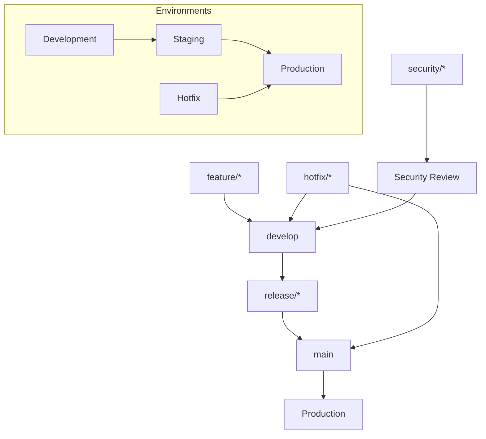
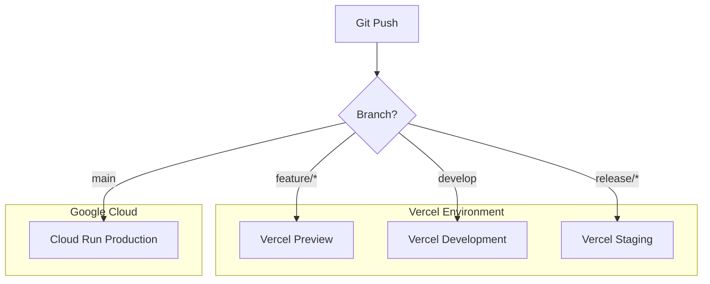
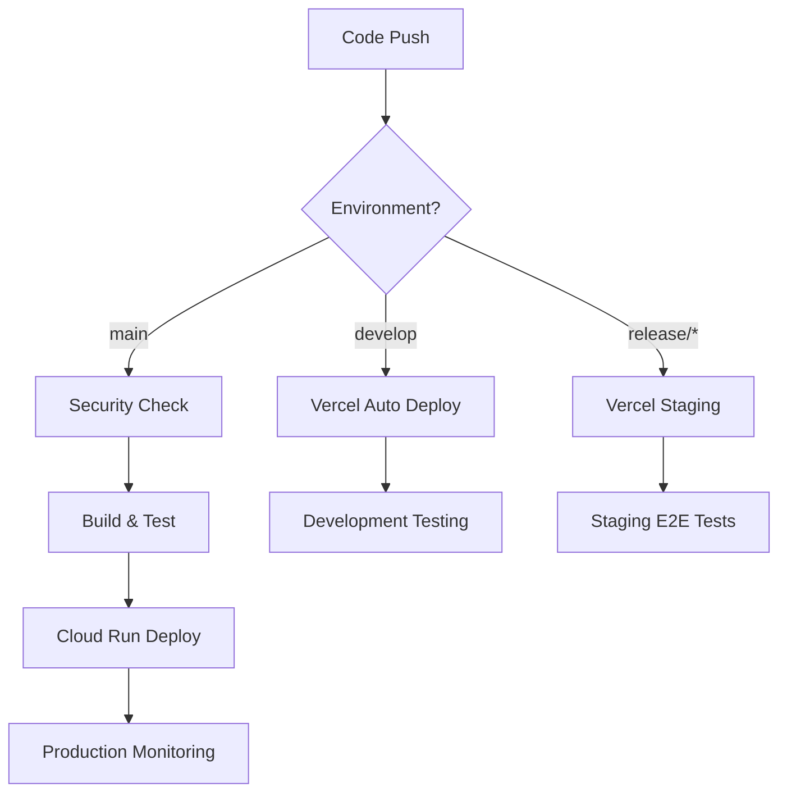

# CouplePlan 改善されたデプロイ戦略

## 概要

本ドキュメントでは、CouplePlanプロジェクトのより堅牢で効率的なCI/CDパイプライン戦略を提案します。セキュリティファースト、マルチ環境、自動化された品質保証を中核とした、エンタープライズレベルのデプロイメント戦略です。

## 🎯 改善の目標

### 現在の実装状況

- ✅ **依存関係スキャン**: Snyk（既に利用中）
- ❌ **ステージング環境の欠如**
- ❌ **コード脆弱性スキャンの不在**
- ❌ **E2Eテストの不実装**
- ❌ **ロールバック機能の不備**
- ❌ **緊急時対応フローの不在**

### 改善後の目標

- **信頼性**: 99.9%のアップタイム
- **セキュリティ**: 既存Snyk + 追加セキュリティ層
- **速度**: 10分以内のデプロイ
- **品質**: 包括的なテスト戦略
- **復旧**: 5分以内の自動ロールバック

## ブランチ戦略（Git Flow Enhanced）



### ブランチの役割

- **feature/\***: 機能開発ブランチ（CI実行）
- **develop**: 開発統合ブランチ（開発環境デプロイ）
- **release/\***: リリース準備ブランチ（ステージング環境デプロイ）
- **main**: 本番リリースブランチ（本番環境デプロイ）
- **hotfix/\***: 緊急修正ブランチ（高速本番デプロイ）
- **security/\***: セキュリティ修正ブランチ（特別レビュー）

## 🏗️ マルチ環境アーキテクチャ

### 環境構成（ハイブリッド戦略）

| 環境            | プラットフォーム | 用途           | トリガー        | URL                              |
| --------------- | ---------------- | -------------- | --------------- | -------------------------------- |
| **Development** | **Vercel**       | 開発テスト     | develop push    | `https://dev.coupleplan.com`     |
| **Staging**     | **Vercel**       | リリース前検証 | release/\* push | `https://staging.coupleplan.com` |
| **Production**  | **Cloud Run**    | 本番サービス   | main push       | `https://coupleplan.com`         |

### ドメイン戦略とDNS設定

```yaml
domain_strategy:
  primary_domain: 'coupleplan.com'

  dns_records:
    # 本番環境（Cloud Run）
    production:
      type: 'A/CNAME'
      name: '@' # coupleplan.com
      target: 'ghs.googlehosted.com' # Cloud Run カスタムドメイン

    # ステージング環境（Vercel）
    staging:
      type: 'CNAME'
      name: 'staging' # staging.coupleplan.com
      target: 'cname.vercel-dns.com'

    # 開発環境（Vercel）
    development:
      type: 'CNAME'
      name: 'dev' # dev.coupleplan.com
      target: 'cname.vercel-dns.com'

    # API専用サブドメイン（オプション）
    api:
      type: 'CNAME'
      name: 'api' # api.coupleplan.com
      target: 'ghs.googlehosted.com'

    # 管理者用サブドメイン（オプション）
    admin:
      type: 'CNAME'
      name: 'admin' # admin.coupleplan.com
      target: 'ghs.googlehosted.com'
```

### SSL証明書とセキュリティ設定

```yaml
ssl_configuration:
  production:
    provider: 'Google-managed SSL'
    domain: 'coupleplan.com'
    auto_renewal: true

  staging:
    provider: 'Vercel SSL'
    domain: 'staging.coupleplan.com'
    auto_renewal: true

  development:
    provider: 'Vercel SSL'
    domain: 'dev.coupleplan.com'
    auto_renewal: true

security_headers:
  hsts:
    max_age: '31536000'
    include_subdomains: true
    preload: true

  csp:
    default_src: "'self'"
    script_src: "'self' 'unsafe-inline' https://vercel.live"
    style_src: "'self' 'unsafe-inline'"

  additional_headers:
    - 'X-Frame-Options: DENY'
    - 'X-Content-Type-Options: nosniff'
    - 'Referrer-Policy: strict-origin-when-cross-origin'
```

### ハイブリッド構成のメリット



**🚀 Vercel活用の利点:**

- **高速デプロイ**: 1-2分でのデプロイ完了
- **自動プレビュー**: PR毎に専用URL生成
- **Next.js最適化**: フレームワーク特化の最適化
- **無料利用**: 開発・ステージングなら無料プランで十分
- **簡単設定**: 最小限の設定でCI/CD実現

**🎯 Cloud Run本番の利点:**

- **エンタープライズ機能**: 高度な監視・ログ
- **スケーラビリティ**: 大規模トラフィック対応
- **セキュリティ**: VPC、IAM統合
- **コスト効率**: 大規模運用時のコスト最適化

### インフラ構成

```yaml
# ハイブリッド環境設定
environments:
  development:
    platform: vercel
    framework: nextjs
    domain: 'dev.coupleplan.com'
    auto_deploy: true
    preview_deployments: true
    build_command: 'npm run build'
    dev_command: 'npm run dev'

  staging:
    platform: vercel
    framework: nextjs
    domain: 'staging.coupleplan.com'
    auto_deploy: true
    environment_protection: true
    build_command: 'npm run build'
    password_protection: true # ステージング保護

  production:
    platform: google_cloud_run
    project: serious-bearing-460203-r6
    service: coupleplan-prod
    region: asia-northeast1
    domain: 'coupleplan.com'
    cpu: 4
    memory: 8Gi
    min_instances: 2
    max_instances: 100
```

### 環境変数管理戦略

```yaml
secrets_strategy:
  development:
    platform: 'Vercel Environment Variables'
    prefix: 'DEV_'
    source: 'Vercel Dashboard'
    security_level: 'basic'

  staging:
    platform: 'Vercel Environment Variables'
    prefix: 'STAGING_'
    source: 'Vercel Dashboard + GitHub Secrets'
    security_level: 'medium'

  production:
    platform: 'Google Secret Manager'
    prefix: 'PROD_'
    source: 'Google Secret Manager + HSM'
    security_level: 'enterprise'
    rotation: '90days'
```

## 🔄 改善されたCI/CDパイプライン

### ハイブリッド環境対応ワークフロー



### GitHub Actions設定例

```yaml
# .github/workflows/hybrid-deployment.yml
name: Hybrid Deployment Strategy

on:
  push:
    branches: [develop, release/*, main]
  pull_request:
    branches: [develop]

jobs:
  # Vercel環境（develop, release/*）
  deploy-vercel:
    if: github.ref == 'refs/heads/develop' || startsWith(github.ref, 'refs/heads/release/')
    runs-on: ubuntu-latest
    steps:
      - uses: actions/checkout@v4

      - name: Deploy to Vercel
        uses: amondnet/vercel-action@v25
        with:
          vercel-token: ${{ secrets.VERCEL_TOKEN }}
          vercel-org-id: ${{ secrets.VERCEL_ORG_ID }}
          vercel-project-id: ${{ secrets.VERCEL_PROJECT_ID }}
          working-directory: ./
          scope: ${{ secrets.VERCEL_ORG_ID }}

  # Cloud Run環境（main）
  deploy-production:
    if: github.ref == 'refs/heads/main'
    runs-on: ubuntu-latest
    needs: [security-scan, tests]
    steps:
      - uses: actions/checkout@v4

      # 既存のCloud Runデプロイロジック
      - name: Deploy to Cloud Run
        # ... 既存の設定
```

## 🔧 実装ガイド

### 1. ドメイン設定の実装手順

#### Step 1: DNS設定

```bash
# DNSプロバイダー（例：Cloudflare, Route53）での設定
# 本番環境
A     @           <Cloud Run IP>
CNAME www         coupleplan.com

# 開発・ステージング環境
CNAME dev         cname.vercel-dns.com
CNAME staging     cname.vercel-dns.com

# オプション：追加サブドメイン
CNAME api         ghs.googlehosted.com
CNAME admin       ghs.googlehosted.com
```

#### Step 2: Vercel カスタムドメイン設定

```bash
# Vercel CLI でのドメイン設定
vercel domains add dev.coupleplan.com
vercel domains add staging.coupleplan.com

# プロジェクトへのドメイン割り当て
vercel domains assign dev.coupleplan.com coupleplan-dev
vercel domains assign staging.coupleplan.com coupleplan-staging
```

#### Step 3: Cloud Run カスタムドメイン設定

```bash
# Cloud Run でのカスタムドメイン設定
gcloud run domain-mappings create \
  --service=coupleplan-prod \
  --domain=coupleplan.com \
  --region=asia-northeast1

# DNS検証レコードの追加（Cloud RunからのGUIで確認）
```

### 2. 環境別設定ファイル

#### Vercel設定（vercel.json）

```json
{
  "version": 2,
  "builds": [
    {
      "src": "package.json",
      "use": "@vercel/next"
    }
  ],
  "routes": [
    {
      "src": "/(.*)",
      "dest": "/$1"
    }
  ],
  "env": {
    "NEXT_PUBLIC_SUPABASE_URL": "@dev_supabase_url",
    "NEXT_PUBLIC_SUPABASE_ANON_KEY": "@dev_supabase_anon_key"
  },
  "headers": [
    {
      "source": "/(.*)",
      "headers": [
        {
          "key": "X-Frame-Options",
          "value": "DENY"
        },
        {
          "key": "X-Content-Type-Options",
          "value": "nosniff"
        }
      ]
    }
  ]
}
```

### 3. 環境判定とリダイレクト処理

```typescript
// utils/domain.ts
export const getDomainConfig = () => {
  const hostname = typeof window !== 'undefined' ? window.location.hostname : '';

  switch (hostname) {
    case 'dev.coupleplan.com':
      return {
        environment: 'development',
        apiUrl: 'https://dev.coupleplan.com/api',
        supabaseUrl: process.env.NEXT_PUBLIC_SUPABASE_URL_DEV,
        analytics: false,
      };

    case 'staging.coupleplan.com':
      return {
        environment: 'staging',
        apiUrl: 'https://staging.coupleplan.com/api',
        supabaseUrl: process.env.NEXT_PUBLIC_SUPABASE_URL_STAGING,
        analytics: false,
      };

    case 'coupleplan.com':
    case 'www.coupleplan.com':
      return {
        environment: 'production',
        apiUrl: 'https://coupleplan.com/api',
        supabaseUrl: process.env.NEXT_PUBLIC_SUPABASE_URL,
        analytics: true,
      };

    default:
      return {
        environment: 'local',
        apiUrl: 'http://localhost:3000/api',
        supabaseUrl: process.env.NEXT_PUBLIC_SUPABASE_URL_LOCAL,
        analytics: false,
      };
  }
};

// WWWリダイレクト設定（Next.js middleware）
// middleware.ts
import { NextResponse } from 'next/server';
import type { NextRequest } from 'next/server';

export function middleware(request: NextRequest) {
  const hostname = request.headers.get('host');

  // www.coupleplan.com → coupleplan.com リダイレクト
  if (hostname === 'www.coupleplan.com') {
    return NextResponse.redirect(
      new URL(`https://coupleplan.com${request.nextUrl.pathname}`, request.url)
    );
  }

  // 本番環境でのBasic認証（ステージング）
  if (hostname === 'staging.coupleplan.com') {
    const basicAuth = request.headers.get('authorization');

    if (!basicAuth) {
      return new NextResponse('Authentication required', {
        status: 401,
        headers: {
          'WWW-Authenticate': 'Basic realm="Staging Environment"',
        },
      });
    }
  }

  return NextResponse.next();
}

export const config = {
  matcher: ['/((?!api|_next/static|_next/image|favicon.ico).*)'],
};
```

### 4. SEO設定とサイトマップ

```typescript
// next-sitemap.config.js
module.exports = {
  siteUrl: 'https://coupleplan.com',
  generateRobotsTxt: true,
  exclude: ['/admin/*', '/api/*'],
  robotsTxtOptions: {
    policies: [
      {
        userAgent: '*',
        disallow: ['/admin/', '/api/'],
        allow: '/',
      },
    ],
    additionalSitemaps: ['https://coupleplan.com/sitemap-pages.xml'],
  },
  transform: async (config, path) => {
    // ステージング・開発環境はインデックス除外
    if (path.includes('staging') || path.includes('dev')) {
      return null;
    }

    return {
      loc: path,
      changefreq: 'daily',
      priority: path === '/' ? 1.0 : 0.7,
      lastmod: new Date().toISOString(),
    };
  },
};
```

## 🎯 ドメイン活用の最適化戦略

### サブドメイン活用提案

```yaml
subdomain_strategy:
  core_services:
    - 'coupleplan.com' # メインサービス
    - 'www.coupleplan.com' # WWWリダイレクト

  development:
    - 'dev.coupleplan.com' # 開発環境
    - 'staging.coupleplan.com' # ステージング環境

  future_expansion:
    - 'api.coupleplan.com' # API専用エンドポイント
    - 'admin.coupleplan.com' # 管理画面
    - 'blog.coupleplan.com' # ブログ/記事
    - 'help.coupleplan.com' # ヘルプ・サポート
    - 'status.coupleplan.com' # ステータスページ
```

### ブランド統一とユーザー体験

```yaml
brand_consistency:
  ssl_certificates:
    - '*.coupleplan.com' # ワイルドカード証明書推奨

  redirect_rules:
    - 'www.coupleplan.com → coupleplan.com'
    - 'http:// → https://'
    - '旧ドメイン → coupleplan.com（もしあれば）'

  analytics_tracking:
    - 'GA4: 環境別プロパティ設定'
    - '本番のみ追跡、開発・ステージングは除外'

  seo_optimization:
    - 'canonical URL設定'
    - 'hreflang設定（将来の国際化対応）'
    - 'robots.txt環境別設定'
```

この実際のドメインを活用することで、より本格的で統一感のあるサービス展開が可能になります！

## 💰 コスト最適化（ハイブリッド構成）

### プラットフォーム別コスト分析

```yaml
cost_analysis:
  vercel:
    development:
      cost: '$0/month'
      plan: 'Hobby (Free)'
      builds: '100/month'
      bandwidth: '1TB/month'

    staging:
      cost: '$20/month'
      plan: 'Pro'
      builds: 'Unlimited'
      bandwidth: '1TB/month'
      features: ['Password Protection', 'Custom Domains']

  google_cloud_run:
    production:
      cost: '$30-100/month (estimated)'
      pricing: 'Pay-per-use'
      features: ['Auto-scaling', 'Enterprise Security', 'Advanced Monitoring']

  total_estimated_cost: '$50-120/month'
  savings_vs_all_cloud_run: '40-60%'
```

### リソース最適化戦略

```yaml
optimization_strategy:
  vercel_environments:
    advantages:
      - zero_cold_start: 'エッジ関数で高速レスポンス'
      - automatic_optimization: 'Next.js特化の最適化'
      - global_cdn: '世界中のエッジでキャッシュ'
      - preview_deployments: 'PR毎の専用環境'

  cloud_run_production:
    advantages:
      - enterprise_features: '高度な監視・ログ'
      - vpc_integration: 'セキュアなネットワーク'
      - custom_scaling: '細かいスケーリング制御'
      - multi_region: '冗長性とディザスタリカバリ'
```

## 📋 実装タイムライン（ハイブリッド版）

### フェーズ1: Vercel環境構築（1週間）

- [x] Snyk依存関係スキャン（実装済み）
- [ ] Vercelプロジェクトセットアップ
- [ ] 開発環境の自動デプロイ設定
- [ ] 環境変数の設定
- [ ] カスタムドメインの設定

### フェーズ2: ステージング環境強化（2週間）

- [ ] Vercelステージング環境の構築
- [ ] プレビューデプロイメントの活用
- [ ] E2Eテストの実装（Vercel環境）
- [ ] Snyk Code有効化

### フェーズ3: 本番環境の高度化（3週間）

- [ ] Cloud Run本番環境の最適化
- [ ] Blue-Green デプロイメント実装
- [ ] 監視・アラートシステム
- [ ] セキュリティ強化

### フェーズ4: 統合・最適化（2週間）

- [ ] 環境間の一貫性確保
- [ ] パフォーマンス最適化
- [ ] コスト最適化
- [ ] ドキュメント整備

## 🎯 ハイブリッド構成の成功指標

### プラットフォーム別KPI

```yaml
vercel_kpis:
  development:
    - deploy_time: '< 2 minutes'
    - build_success_rate: '> 95%'
    - preview_deployment_usage: '> 80% of PRs'

  staging:
    - deploy_time: '< 3 minutes'
    - uptime: '> 99%'
    - e2e_test_success_rate: '> 90%'

cloud_run_kpis:
  production:
    - uptime: '> 99.9%'
    - response_time: '< 500ms'
    - error_rate: '< 0.1%'
    - auto_scaling_efficiency: '> 95%'

overall_benefits:
  development_velocity:
    - feature_iteration_time: '50% faster'
    - pr_review_efficiency: '40% improvement'
    - bug_detection_speed: '60% faster'

  cost_efficiency:
    - infrastructure_cost: '40-60% reduction'
    - operational_overhead: '30% reduction'
    - developer_productivity: '25% increase'
```

## 📚 関連リソース

### ドキュメント

- [セキュリティガイドライン](./security-guidelines.md)
- [監視・アラート設定](./monitoring-setup.md)
- [インシデント対応プロトコル](./incident-response.md)
- [パフォーマンス最適化ガイド](./performance-optimization.md)

### ツール・サービス

- [Google Cloud Console](https://console.cloud.google.com/)
- [GitHub Actions](https://github.com/features/actions)
- [Semgrep Dashboard](https://semgrep.dev/)
- [Snyk Dashboard](https://app.snyk.io/)

---

_最終更新: 2024年12月_
_バージョン: 2.0 (改善版)_
