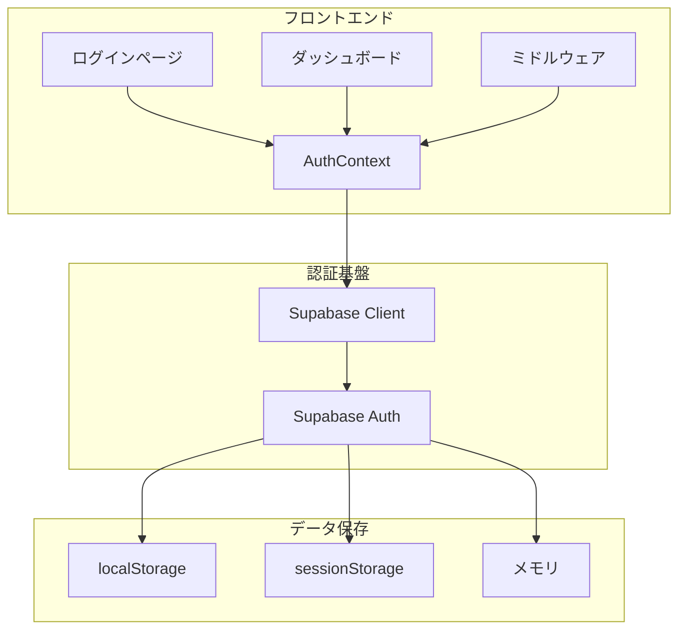
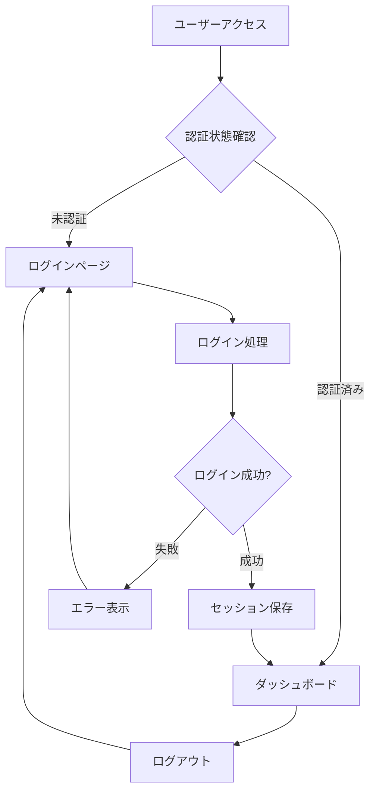

# 認証システム設計書

## 📋 目次

1. [概要](#概要)
2. [アーキテクチャ](#アーキテクチャ)
3. [認証フロー](#認証フロー)
4. [セッション管理](#セッション管理)
5. [セキュリティ](#セキュリティ)
6. [トラブルシューティング](#トラブルシューティング)
7. [今後の改善点](#今後の改善点)

---

## 概要

CouplePlanアプリケーションの認証システムは、**Supabase Authentication**を基盤としたシンプルで確実な認証フローを提供します。

### 🎯 設計方針

- **シンプル**: 複雑な認証フローを排除
- **確実**: 安定した認証処理
- **セキュア**: 適切なセキュリティ対策
- **ユーザーフレンドリー**: 直感的なユーザー体験

---

## アーキテクチャ

### システム構成図



### コンポーネント構成

```
src/
├── contexts/
│   └── AuthContext.tsx          # 認証状態管理
├── lib/
│   └── supabase-auth.ts         # Supabaseクライアント設定
├── app/
│   ├── (auth)/
│   │   ├── login/page.tsx          # ログインページ
│   │   └── signup/page.tsx      # サインアップページ
│   └── dashboard/page.tsx        # ダッシュボード
└── middleware.ts                 # 認証ミドルウェア
```

---

## 認証フロー

### 全体フロー



### ログイン処理の詳細

#### 1. ユーザー入力

- メールアドレス
- パスワード

#### 2. 認証処理

```typescript
const { data, error } = await supabase.auth.signInWithPassword({
  email,
  password,
});
```

#### 3. エラーハンドリング

| エラー                    | 原因                   | 解決策                                 |
| ------------------------- | ---------------------- | -------------------------------------- |
| Invalid login credentials | 認証情報が間違っている | 正しいメールアドレス・パスワードを入力 |
| Email not confirmed       | メール認証が未完了     | 確認メールをチェック                   |
| Too many requests         | ログイン試行回数超過   | しばらく待ってから再試行               |

#### 4. リダイレクト

```typescript
const redirectUrl = getRedirectUrl();
router.push(redirectUrl);
```

### ミドルウェア認証

#### 保護されたパス

```typescript
const protectedPaths = ['/dashboard', '/profile', '/settings'];
```

#### 認証チェックフロー

1. **パス確認**: 保護されたパスかどうかをチェック
2. **セッション取得**: Supabaseからセッション情報を取得
3. **リダイレクト**: 未認証の場合はログインページにリダイレクト

---

## セッション管理

### セッションとは？

セッションとは、ユーザーがログインした後、そのログイン状態を維持するための仕組みです。

**身近な例:**

- Gmailにログインした後、ブラウザを閉じても再度開いた時にログイン状態が続いている
- Amazonで買い物中に、他のページに移動してもログイン状態が維持されている

### セッションの構成要素

```typescript
{
  access_token: "eyJhbGciOiJIUzI1NiIs...", // アクセストークン（身分証明書）
  refresh_token: "v1.MQo5ODk4OTg5ODk4...", // リフレッシュトークン（引換券）
  expires_at: 1640995200,                   // 有効期限
  user: {                                   // ユーザー情報
    id: "12345678-1234-1234-1234-123456789012",
    email: "user@example.com",
    created_at: "2023-01-01T00:00:00Z"
  }
}
```

### セッション保存場所

| 保存場所           | 特徴                   | 用途                   | 注意点                         |
| ------------------ | ---------------------- | ---------------------- | ------------------------------ |
| **localStorage**   | ブラウザを閉じても残る | 長期間ログイン状態維持 | プライベートモードでは使用不可 |
| **sessionStorage** | タブを閉じると消える   | 一時的なログイン状態   | プライベートモードでは使用不可 |
| **メモリ**         | ページリロードで消える | 一時的な認証状態       | 最も短時間で消える             |

### セッションライフサイクル

```
1. ユーザーログイン
   ↓
2. セッション作成（身分証明書発行）
   ↓
3. localStorageに保存（身分証明書を金庫に保管）
   ↓
4. ページ遷移（他のページに移動）
   ↓
5. セッション有効性チェック（身分証明書が有効か確認）
   ↓
6. 有効 → ログイン状態維持
   無効 → 再ログイン要求
   ↓
7. 自動トークン更新（身分証明書の期限延長）
   ↓
8. ログアウト（身分証明書を破棄）
```

### Supabaseクライアント設定

```typescript
export const supabase = createClient(supabaseUrl, supabaseAnonKey, {
  auth: {
    autoRefreshToken: true, // 自動トークン更新
    persistSession: true, // セッション永続化
    detectSessionInUrl: true, // URL内セッション検出
    flowType: 'pkce', // PKCE認証フロー
  },
});
```

### セッション管理方式の比較

| 方式                         | プライベートブラウジング | サーバー負荷 | 実装の複雑さ | 一般的な使用例  |
| ---------------------------- | ------------------------ | ------------ | ------------ | --------------- |
| **サーバーサイドセッション** | ✅ 動作する              | 高い         | 複雑         | 従来のWebアプリ |
| **JWT + localStorage**       | ❌ 制限あり              | 低い         | 簡単         | モダンなSPA     |
| **JWT + メモリ**             | ✅ 動作する              | 低い         | 中程度       | 一時的な認証    |

**SupabaseがlocalStorageを使用する理由:**

- モダンなSPA（Single Page Application）の標準
- 開発者体験の向上
- スケーラビリティの確保
- サーバーリソースの節約

---

## セキュリティ

### 認証フロー

- **PKCE認証フロー**: セキュリティを強化した認証方式
- **自動トークン更新**: セッションの有効性を維持
- **セッション永続化**: ユーザー体験の向上

### データ保護

- **HTTPS通信**: 暗号化された通信
- **JWT暗号化**: トークンの改ざん検知
- **有効期限管理**: 短時間のアクセストークン、長期間のリフレッシュトークン

### エラーハンドリング

- **詳細なエラーメッセージ**: ユーザーフレンドリーなエラー表示
- **レート制限**: 不正アクセスの防止
- **セッション検証**: 認証状態の確実な確認

---

## トラブルシューティング

### よくある問題

#### 1. セッションが保存されない

- **原因**: プライベートブラウジングモード
- **解決策**: 通常のブラウジングモードでアクセス

#### 2. ログイン後リダイレクトされない

- **原因**: セッション同期の問題
- **解決策**: ページリフレッシュまたは再ログイン

#### 3. 認証エラーが発生する

- **原因**: 無効な認証情報
- **解決策**: 正しいメールアドレス・パスワードを入力

#### 4. 複数タブでログイン状態が同期されない

- **原因**: セッション更新の通知が届かない
- **解決策**: ページをリフレッシュする

### デバッグ方法

#### コンソールログの確認

```typescript
console.log('認証状態:', session ? 'exists' : 'null');
console.log('ユーザー情報:', user);
```

#### セッション状態の確認

```typescript
const {
  data: { session },
} = await supabase.auth.getSession();
console.log('セッション:', session);
```

---

## 今後の改善点

### 機能拡張

- **ソーシャルログイン**: Google、GitHub認証
- **多要素認証**: セキュリティの強化
- **パスワードリセット**: パスワード忘れ対応

### パフォーマンス改善

- **セッションキャッシュ**: 認証状態の高速化
- **プリロード**: 認証情報の事前読み込み
- **最適化**: 認証フローの高速化

### ユーザー体験向上

- **自動ログイン**: セッション維持の改善
- **エラー回復**: 自動的なエラー回復
- **アクセシビリティ**: ユーザビリティの向上

---

## まとめ

CouplePlanの認証システムは、Supabase Authenticationを基盤としたシンプルで確実な認証フローを提供します。

### 主要な特徴

- **シンプルな設計**: 複雑な認証フローを排除
- **確実な動作**: 安定した認証処理
- **セキュリティ**: 適切なセキュリティ対策
- **ユーザビリティ**: 直感的なユーザー体験

この設計により、ユーザーは安全で快適な認証体験を得ることができます。
