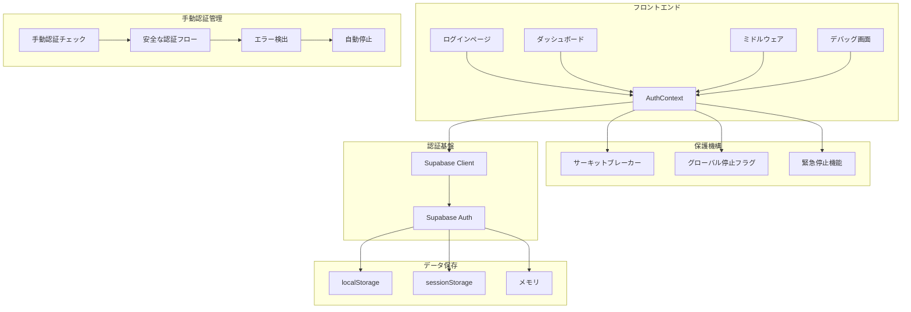
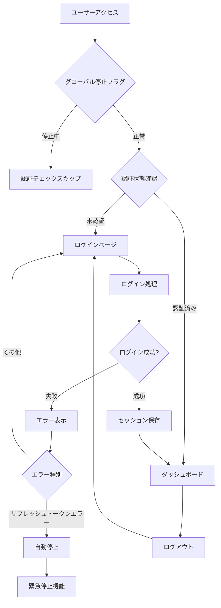

# 認証システム設計書

## 📋 目次

1. [概要](#概要)
2. [アーキテクチャ](#アーキテクチャ)
3. [認証フロー](#認証フロー)
4. [セッション管理](#セッション管理)
5. [セキュリティ](#セキュリティ)
6. [トラブルシューティング](#トラブルシューティング)
7. [今後の改善点](#今後の改善点)

---

## 概要

CouplePlanアプリケーションの認証システムは、**Supabase Authentication**を基盤とした堅牢で安定した認証フローを提供します。レート制限やトークンエラーに対する高度な保護機構を備えています。

### 🎯 設計方針

- **堅牢性**: エラーに対する強力な保護機構
- **安定性**: サーキットブレーカーによる自動復旧
- **セキュア**: 適切なセキュリティ対策
- **ユーザーフレンドリー**: 直感的なユーザー体験
- **開発者フレンドリー**: デバッグ機能と緊急停止機能

---

## アーキテクチャ

### システム構成図



### コンポーネント構成

```
src/
├── contexts/
│   └── AuthContext.tsx          # 認証状態管理（手動認証対応）
├── lib/
│   ├── supabase-auth.ts         # Supabaseクライアント設定
│   ├── manual-auth.ts           # 手動認証管理
│   ├── circuit-breaker.ts       # サーキットブレーカー
│   ├── auth-stop.ts             # グローバル停止フラグ
│   ├── force-stop.ts            # 緊急停止スクリプト
│   └── emergency-stop.ts        # 緊急停止機能
├── app/
│   ├── (auth)/
│   │   ├── login/page.tsx          # ログインページ
│   │   └── signup/page.tsx      # サインアップページ
│   ├── debug/
│   │   └── auth/page.tsx            # 認証デバッグ画面
│   └── dashboard/page.tsx        # ダッシュボード
└── middleware.ts                 # 認証ミドルウェア（保護機構統合）
```

---

## 認証フロー

### 全体フロー（保護機構統合）



### ログイン処理の詳細

#### 1. ユーザー入力

- メールアドレス
- パスワード

#### 2. 認証処理

```typescript
const { data, error } = await supabase.auth.signInWithPassword({
  email,
  password,
});
```

#### 3. エラーハンドリング（保護機構統合）

| エラー                    | 原因                     | 解決策                                 | 保護機構       |
| ------------------------- | ------------------------ | -------------------------------------- | -------------- |
| Invalid login credentials | 認証情報が間違っている   | 正しいメールアドレス・パスワードを入力 | 通常処理       |
| Email not confirmed       | メール認証が未完了       | 確認メールをチェック                   | 通常処理       |
| Too many requests         | ログイン試行回数超過     | しばらく待ってから再試行               | レート制限対応 |
| refresh_token_not_found   | リフレッシュトークン破損 | 自動停止・セッションクリア             | 緊急停止       |
| over_request_rate_limit   | Supabaseレート制限       | 自動停止・待機                         | 緊急停止       |

#### 4. リダイレクト

```typescript
const redirectUrl = getRedirectUrl();
router.push(redirectUrl);
```

### ミドルウェア認証

#### 保護されたパス

```typescript
const protectedPaths = ['/dashboard', '/profile', '/settings'];
```

#### 認証チェックフロー

1. **パス確認**: 保護されたパスかどうかをチェック
2. **セッション取得**: Supabaseからセッション情報を取得
3. **リダイレクト**: 未認証の場合はログインページにリダイレクト

---

## セッション管理

### セッションとは？

セッションとは、ユーザーがログインした後、そのログイン状態を維持するための仕組みです。

**身近な例:**

- Gmailにログインした後、ブラウザを閉じても再度開いた時にログイン状態が続いている
- Amazonで買い物中に、他のページに移動してもログイン状態が維持されている

### セッションの構成要素

```typescript
{
  access_token: "eyJhbGciOiJIUzI1NiIs...", // アクセストークン（身分証明書）
  refresh_token: "v1.MQo5ODk4OTg5ODk4...", // リフレッシュトークン（引換券）
  expires_at: 1640995200,                   // 有効期限
  user: {                                   // ユーザー情報
    id: "12345678-1234-1234-1234-123456789012",
    email: "user@example.com",
    created_at: "2023-01-01T00:00:00Z"
  }
}
```

### セッション保存場所

| 保存場所           | 特徴                   | 用途                   | 注意点                         |
| ------------------ | ---------------------- | ---------------------- | ------------------------------ |
| **localStorage**   | ブラウザを閉じても残る | 長期間ログイン状態維持 | プライベートモードでは使用不可 |
| **sessionStorage** | タブを閉じると消える   | 一時的なログイン状態   | プライベートモードでは使用不可 |
| **メモリ**         | ページリロードで消える | 一時的な認証状態       | 最も短時間で消える             |

### セッションライフサイクル

```
1. ユーザーログイン
   ↓
2. セッション作成（身分証明書発行）
   ↓
3. localStorageに保存（身分証明書を金庫に保管）
   ↓
4. ページ遷移（他のページに移動）
   ↓
5. セッション有効性チェック（身分証明書が有効か確認）
   ↓
6. 有効 → ログイン状態維持
   無効 → 再ログイン要求
   ↓
7. 自動トークン更新（身分証明書の期限延長）
   ↓
8. ログアウト（身分証明書を破棄）
```

### Supabaseクライアント設定（手動認証対応）

```typescript
export const supabase = createClient(supabaseUrl, supabaseAnonKey, {
  auth: {
    autoRefreshToken: false, // 手動認証管理のため無効化
    persistSession: true, // セッション永続化
    detectSessionInUrl: true, // URL内セッション検出
    flowType: 'pkce', // PKCE認証フロー
  },
});
```

### 手動認証管理

```typescript
// 安全な認証チェック
const status = await safeAuthCheck();

// 手動トークンリフレッシュ
const success = await refreshToken();

// 破損したセッションの検出とクリア
const isCorrupted = await detectAndClearCorruptedSession();
```

### セッション管理方式の比較

| 方式                         | プライベートブラウジング | サーバー負荷 | 実装の複雑さ | 一般的な使用例  |
| ---------------------------- | ------------------------ | ------------ | ------------ | --------------- |
| **サーバーサイドセッション** | ✅ 動作する              | 高い         | 複雑         | 従来のWebアプリ |
| **JWT + localStorage**       | ❌ 制限あり              | 低い         | 簡単         | モダンなSPA     |
| **JWT + メモリ**             | ✅ 動作する              | 低い         | 中程度       | 一時的な認証    |

**SupabaseがlocalStorageを使用する理由:**

- モダンなSPA（Single Page Application）の標準
- 開発者体験の向上
- スケーラビリティの確保
- サーバーリソースの節約

---

## セキュリティ

### 認証フロー

- **PKCE認証フロー**: セキュリティを強化した認証方式
- **手動トークン管理**: より細かい制御とエラー対応
- **セッション永続化**: ユーザー体験の向上

### データ保護

- **HTTPS通信**: 暗号化された通信
- **JWT暗号化**: トークンの改ざん検知
- **有効期限管理**: 短時間のアクセストークン、長期間のリフレッシュトークン

### エラーハンドリング（保護機構統合）

- **詳細なエラーメッセージ**: ユーザーフレンドリーなエラー表示
- **レート制限対応**: Supabaseレート制限の自動検出と対応
- **サーキットブレーカー**: 連続エラー時の自動停止
- **グローバル停止フラグ**: システム全体の認証停止
- **緊急停止機能**: 手動での即座停止
- **セッション検証**: 認証状態の確実な確認

### 保護機構

#### サーキットブレーカー

- **3回連続失敗**: 自動的に認証チェックを停止
- **30秒クールダウン**: エラー後の待機期間
- **自動復旧**: 成功時の自動再開

#### グローバル停止フラグ

- **即座停止**: リフレッシュトークンエラー検出時の自動停止
- **手動制御**: 開発者による手動停止・再開
- **状態監視**: リアルタイムでの停止状態確認

---

## トラブルシューティング

### よくある問題

#### 1. セッションが保存されない

- **原因**: プライベートブラウジングモード
- **解決策**: 通常のブラウジングモードでアクセス

#### 2. ログイン後リダイレクトされない

- **原因**: セッション同期の問題
- **解決策**: ページリフレッシュまたは再ログイン

#### 3. 認証エラーが発生する

- **原因**: 無効な認証情報
- **解決策**: 正しいメールアドレス・パスワードを入力

#### 4. 複数タブでログイン状態が同期されない

- **原因**: セッション更新の通知が届かない
- **解決策**: ページをリフレッシュする

#### 5. リフレッシュトークンエラー（refresh_token_not_found）

- **原因**: 破損したセッションまたはレート制限
- **解決策**: 自動停止機能が動作、手動でセッションクリア
- **緊急対応**: `forceStopAuth()` をブラウザコンソールで実行

#### 6. Supabaseレート制限エラー（over_request_rate_limit）

- **原因**: API呼び出し回数超過
- **解決策**: 自動停止機能が動作、1時間待機
- **緊急対応**: デバッグ画面で緊急停止を実行

### デバッグ方法

#### デバッグ画面の利用

```
http://localhost:3000/debug/auth
```

- リアルタイム状態監視
- 手動操作機能
- システム状態の可視化

#### ブラウザコンソールでの操作

```typescript
// 認証システムの状態確認
checkAuthStatus();

// 緊急停止
forceStopAuth();

// 認証システム再開
forceResumeAuth();

// サーキットブレーカーの状態確認
authCircuitBreaker.getState();
```

#### コンソールログの確認

```typescript
console.log('認証状態:', session ? 'exists' : 'null');
console.log('ユーザー情報:', user);
console.log('サーキットブレーカー:', authCircuitBreaker.getState());
```

#### セッション状態の確認

```typescript
const {
  data: { session },
} = await supabase.auth.getSession();
console.log('セッション:', session);
```

### 緊急対応手順

1. **即座にエラーを停止**

   ```javascript
   forceStopAuth();
   ```

2. **ブラウザのキャッシュをクリア**
   - 開発者ツール → Application → Storage → Clear storage

3. **開発サーバーを再起動**

   ```bash
   npm run dev
   ```

4. **認証システムを再開**
   ```javascript
   forceResumeAuth();
   ```

---

## 今後の改善点

### 機能拡張

- **ソーシャルログイン**: Google、GitHub認証
- **多要素認証**: セキュリティの強化
- **パスワードリセット**: パスワード忘れ対応
- **認証状態の永続化**: より安定したセッション管理

### パフォーマンス改善

- **セッションキャッシュ**: 認証状態の高速化
- **プリロード**: 認証情報の事前読み込み
- **最適化**: 認証フローの高速化
- **サーキットブレーカーの調整**: より細かい制御

### ユーザー体験向上

- **自動ログイン**: セッション維持の改善
- **エラー回復**: 自動的なエラー回復
- **アクセシビリティ**: ユーザビリティの向上
- **デバッグ機能の強化**: より詳細な状態監視

### 開発者体験向上

- **デバッグツールの拡張**: より詳細な診断機能
- **ログ機能の強化**: より詳細なエラー追跡
- **テスト機能の追加**: 自動テストの実装
- **ドキュメントの充実**: より詳細な使用方法

---

## まとめ

CouplePlanの認証システムは、Supabase Authenticationを基盤とした堅牢で安定した認証フローを提供します。高度な保護機構により、エラーに対する強力な耐性を持っています。

### 主要な特徴

- **堅牢な設計**: エラーに対する強力な保護機構
- **安定した動作**: サーキットブレーカーによる自動復旧
- **セキュリティ**: 適切なセキュリティ対策
- **ユーザビリティ**: 直感的なユーザー体験
- **開発者フレンドリー**: デバッグ機能と緊急停止機能

### 保護機構の効果

- **無限ループの防止**: リフレッシュトークンエラーの自動停止
- **レート制限対応**: Supabaseレート制限の自動検出と対応
- **即座の復旧**: 緊急停止機能による迅速な問題解決
- **状態監視**: リアルタイムでのシステム状態確認

この設計により、ユーザーは安全で快適な認証体験を得ることができ、開発者は効率的な開発とデバッグを行うことができます。
